# Mermaid.js v11

## Overview

Create text-based diagrams using Mermaid.js v11 declarative syntax. Convert code to SVG/PNG/PDF via CLI or render in browsers/markdown files.

## Quick Start

**Basic Diagram Structure:**
```
{diagram-type}
  {diagram-content}
```

**Common Diagram Types:**
- `flowchart` - Process flows, decision trees
- `sequenceDiagram` - Actor interactions, API flows
- `classDiagram` - OOP structures, data models
- `stateDiagram` - State machines, workflows
- `erDiagram` - Database relationships
- `gantt` - Project timelines
- `journey` - User experience flows

See `references/diagram-types.md` for all 24+ types with syntax.

## Creating Diagrams

**Inline Markdown Code Blocks:**
````markdown
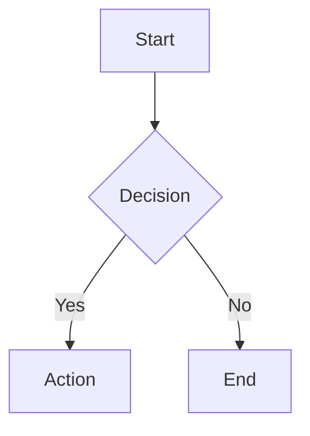
````

**Configuration via Frontmatter:**
````markdown

````

**Comments:** Use `%% ` prefix for single-line comments.

## CLI Usage

Convert `.mmd` files to images:
```bash
# Installation
npm install -g @mermaid-js/mermaid-cli

# Basic conversion
mmdc -i diagram.mmd -o diagram.svg

# With theme and background
mmdc -i input.mmd -o output.png -t dark -b transparent

# Custom styling
mmdc -i diagram.mmd --cssFile style.css -o output.svg
```

See `references/cli-usage.md` for Docker, batch processing, and advanced workflows.

## JavaScript Integration

**HTML Embedding:**
```html
<pre class="mermaid">
  flowchart TD
    A[Client] --> B[Server]
</pre>
<script src="https://cdn.jsdelivr.net/npm/mermaid@latest/dist/mermaid.min.js"></script>
<script>mermaid.initialize({ startOnLoad: true });</script>
```

See `references/integration.md` for Node.js API and advanced integration patterns.

## Configuration & Theming

**Common Options:**
- `theme`: "default", "dark", "forest", "neutral", "base"
- `look`: "classic", "handDrawn"
- `fontFamily`: Custom font specification
- `securityLevel`: "strict", "loose", "antiscript"

See `references/configuration.md` for complete config options, theming, and customization.

## Practical Patterns

Load `references/examples.md` for:
- Architecture diagrams
- API documentation flows
- Database schemas
- Project timelines
- State machines
- User journey maps

## Resources

- `references/diagram-types.md` - Syntax for all 24+ diagram types
- `references/configuration.md` - Config, theming, accessibility
- `references/cli-usage.md` - CLI commands and workflows
- `references/integration.md` - JavaScript API and embedding
- `references/examples.md` - Practical patterns and use cases


---

## Reference Workflows

> The following sections are inlined from the skill's reference files for Cursor compatibility.

### cli usage

# Mermaid.js CLI Usage

Command-line interface for converting Mermaid diagrams to SVG/PNG/PDF.

## Installation

**Global Install:**
```bash
npm install -g @mermaid-js/mermaid-cli
```

**Local Install:**
```bash
npm install @mermaid-js/mermaid-cli
./node_modules/.bin/mmdc -h
```

**No Install (npx):**
```bash
npx -p @mermaid-js/mermaid-cli mmdc -h
```

**Docker:**
```bash
docker pull ghcr.io/mermaid-js/mermaid-cli/mermaid-cli
```

**Requirements:** Node.js ^18.19 || >=20.0

## Basic Commands

**Convert to SVG:**
```bash
mmdc -i input.mmd -o output.svg
```

**Convert to PNG:**
```bash
mmdc -i input.mmd -o output.png
```

**Convert to PDF:**
```bash
mmdc -i input.mmd -o output.pdf
```

Output format determined by file extension.

## CLI Flags

**Core Options:**
- `-i, --input <file>` - Input file (use `-` for stdin)
- `-o, --output <file>` - Output file path
- `-t, --theme <name>` - Theme: default, dark, forest, neutral
- `-b, --background <color>` - Background: transparent, white, #hex
- `--cssFile <file>` - Custom CSS for styling
- `--configFile <file>` - Mermaid configuration file
- `-h, --help` - Show all options

**Example with All Options:**
```bash
mmdc -i diagram.mmd -o output.png \
  -t dark \
  -b transparent \
  --cssFile custom.css \
  --configFile mermaid-config.json
```

## Advanced Usage

**Stdin Piping:**
```bash
cat diagram.mmd | mmdc --input - -o output.svg

# Or inline
cat << EOF | mmdc --input - -o output.svg
graph TD
  A[Start] --> B[End]
EOF
```

**Batch Processing:**
```bash
for file in *.mmd; do
  mmdc -i "$file" -o "${file%.mmd}.svg"
done
```

**Markdown Files:**
Process markdown with embedded diagrams:
```bash
mmdc -i README.template.md -o README.md
```

## Docker Workflows

**Basic Docker Usage:**
```bash
docker run --rm \
  -u $(id -u):$(id -g) \
  -v /path/to/diagrams:/data \
  ghcr.io/mermaid-js/mermaid-cli/mermaid-cli \
  -i diagram.mmd -o output.svg
```

**Mount Working Directory:**
```bash
docker run --rm -v $(pwd):/data \
  ghcr.io/mermaid-js/mermaid-cli/mermaid-cli \
  -i /data/input.mmd -o /data/output.png
```

**Podman (with SELinux):**
```bash
podman run --userns keep-id --user ${UID} \
  --rm -v /path/to/diagrams:/data:z \
  ghcr.io/mermaid-js/mermaid-cli/mermaid-cli \
  -i diagram.mmd
```

## Configuration Files

**Mermaid Config (JSON):**
```json
{
  "theme": "dark",
  "look": "handDrawn",
  "fontFamily": "Arial",
  "flowchart": {
    "curve": "basis"
  }
}
```

**Usage:**
```bash
mmdc -i input.mmd --configFile config.json -o output.svg
```

**Custom CSS:**
```css
.node rect {
  fill: #f9f;
  stroke: #333;
}
.edgeLabel {
  background-color: white;
}
```

**Usage:**
```bash
mmdc -i input.mmd --cssFile styles.css -o output.svg
```

## Node.js API

**Programmatic Usage:**
```javascript
import { run } from '@mermaid-js/mermaid-cli';

await run('input.mmd', 'output.svg', {
  theme: 'dark',
  backgroundColor: 'transparent'
});
```

**With Options:**
```javascript
import { run } from '@mermaid-js/mermaid-cli';

await run('diagram.mmd', 'output.png', {
  theme: 'forest',
  backgroundColor: '#ffffff',
  cssFile: 'custom.css',
  configFile: 'config.json'
});
```

## Common Workflows

**Documentation Generation:**
```bash
# Convert all diagrams in docs/
find docs/ -name "*.mmd" -exec sh -c \
  'mmdc -i "$1" -o "${1%.mmd}.svg"' _ {} \;
```

**Styled Output:**
```bash
# Create dark-themed transparent diagrams
mmdc -i architecture.mmd -o arch.png \
  -t dark \
  -b transparent \
  --cssFile animations.css
```

**CI/CD Pipeline:**
```yaml
# GitHub Actions example
- name: Generate Diagrams
  run: |
    npm install -g @mermaid-js/mermaid-cli
    mmdc -i docs/diagram.mmd -o docs/diagram.svg
```

**Accessibility-Enhanced:**
```bash
# Diagrams with accTitle/accDescr preserved
mmdc -i accessible-diagram.mmd -o output.svg
```

## Troubleshooting

**Permission Issues (Docker):**
Use `-u $(id -u):$(id -g)` to match host user permissions.

**Large Diagrams:**
Increase Node.js memory:
```bash
NODE_OPTIONS="--max-old-space-size=4096" mmdc -i large.mmd -o out.svg
```

**Validation:**
Check syntax before rendering:
```bash
mmdc -i diagram.mmd -o /dev/null || echo "Invalid syntax"
```


### configuration

# Mermaid.js Configuration & Theming

Configuration options, theming, and customization for Mermaid.js v11.

## Configuration Methods

**1. Site-wide Initialization:**
```javascript
mermaid.initialize({
  theme: 'dark',
  startOnLoad: true,
  securityLevel: 'strict',
  fontFamily: 'Arial'
});
```

**2. Diagram-level Frontmatter:**
````markdown

````

**3. Configuration Hierarchy:**
Default config → Site config → Diagram config (highest priority)

## Core Options

**Rendering:**
- `startOnLoad`: Auto-render on page load (default: true)
- `securityLevel`: "strict" (default), "loose", "antiscript", "sandbox"
- `deterministicIds`: Reproducible SVG IDs (default: false)
- `maxTextSize`: Max diagram text (default: 50000)
- `maxEdges`: Max drawable edges (default: 500)

**Visual Style:**
- `look`: "classic" (default), "handDrawn"
- `handDrawnSeed`: Numeric seed for hand-drawn consistency
- `darkMode`: Boolean toggle

**Typography:**
- `fontFamily`: "trebuchet ms, verdana, arial, sans-serif" (default)
- `fontSize`: Base text size (default: 16)

**Layout:**
- `layout`: "dagre" (default), "elk", "tidy-tree", "cose-bilkent"

**Debug:**
- `logLevel`: 0-5 from trace to fatal
- `htmlLabels`: Enable HTML in labels (default: false)

## Theming

**Built-in Themes:**
- `default` - Standard colors
- `dark` - Dark background
- `forest` - Green tones
- `neutral` - Grayscale
- `base` - Fully customizable

**Theme Variables (base theme only):**
```javascript
mermaid.initialize({
  theme: 'base',
  themeVariables: {
    primaryColor: '#ff0000',
    primaryTextColor: '#fff',
    primaryBorderColor: '#7C0000',
    secondaryColor: '#006100',
    tertiaryColor: '#fff'
  }
});
```

**Customizable Variables:**
- Color families: primary, secondary, tertiary
- Node backgrounds and text colors
- Border and line colors
- Note background/text
- Diagram-specific (flowchart nodes, sequence actors, pie sections)

**Custom CSS:**
```javascript
mermaid.initialize({
  themeCSS: `
    .node rect { fill: #f9f; }
    .edgeLabel { background-color: white; }
  `
});
```

## Accessibility

**ARIA Support:**
```
accTitle: Diagram Title
accDescr: Brief description
accDescr {
  Multi-line detailed
  description
}
```

**Auto-generated:**
- `aria-roledescription` attributes
- `<title>` and `<desc>` SVG elements
- `aria-labelledby` and `aria-describedby`

**WCAG Compliance:**
Available for all diagram types (flowchart, sequence, class, Gantt, etc.)

## Icon Configuration

**Register Icon Packs:**
```javascript
import { registerIconPacks } from 'mermaid';
registerIconPacks([
  {
    name: 'logos',
    loader: () => import('https://esm.run/@iconify-json/logos')
  }
]);
```

**Usage:**
```
architecture-beta
  service api(logos:nodejs)[API]
```

**Loading Methods:**
1. CDN-based (lazy loading)
2. npm with dynamic import
3. Direct import

## Math Rendering

**KaTeX Support:**
```
graph LR
  A["$$f(x) = x^2$$"] --> B
```

**Configuration:**
- `legacyMathML`: Use old MathML rendering
- `forceLegacyMathML`: Force legacy even if browser supports native

## Security

**Security Levels:**
- `strict` - HTML encoding (default, recommended)
- `loose` - Some HTML allowed
- `antiscript` - Filter scripts
- `sandbox` - Sandboxed mode

**DOMPurify:**
Enabled by default for XSS protection. Customize via `dompurifyConfig` (use caution).

## Layout Algorithms

**dagre (default):**
Standard hierarchical layout for most diagrams.

**elk:**
Advanced layout with better handling of complex graphs.

**tidy-tree:**
Clean tree structures for hierarchies.

**cose-bilkent:**
Compound graph layout for nested structures.

**Per-diagram Configuration:**
````markdown

````

## Common Patterns

**Consistent Hand-drawn Style:**
```javascript
mermaid.initialize({
  look: 'handDrawn',
  handDrawnSeed: 42  // Same seed = consistent appearance
});
```

**Dark Mode Toggle:**
```javascript
const isDark = window.matchMedia('(prefers-color-scheme: dark)').matches;
mermaid.initialize({
  theme: isDark ? 'dark' : 'default'
});
```

**Performance Optimization:**
```javascript
mermaid.initialize({
  startOnLoad: false,  // Manual rendering
  maxEdges: 1000,       // Increase for complex graphs
  deterministicIds: true  // Caching-friendly
});
```

## Validation

**Parse without Rendering:**
```javascript
try {
  await mermaid.parse('graph TD\nA-->B');
  console.log('Valid syntax');
} catch(e) {
  console.error('Invalid:', e);
}
```

**Programmatic Rendering:**
```javascript
const { svg } = await mermaid.render('graphId', 'graph TD\nA-->B');
document.getElementById('output').innerHTML = svg;
```


### diagram types

# Mermaid.js Diagram Types

Comprehensive syntax reference for all 24+ diagram types in Mermaid.js v11.

## Core Diagrams

### Flowchart
Process flows, decision trees, workflows.

**Syntax:**
```
flowchart {direction}
  {nodeId}[{label}] {arrow} {nodeId}[{label}]
```

**Directions:** TB/TD (top-bottom), BT, LR (left-right), RL
**Shapes:** `()` round, `[]` rect, `{}` diamond, `{{}}` hexagon, `(())` circle
**Arrows:** `-->` solid, `-.->` dotted, `==>` thick
**Subgraphs:** Group related nodes

### Sequence Diagram
Actor interactions, API flows, message sequences.

**Syntax:**
```
sequenceDiagram
  participant A as Actor
  A->>B: Message
  activate B
  B-->>A: Response
  deactivate B
```

**Arrows:** `->` solid, `->>` arrow, `-->` dotted, `-x` cross, `-)` async
**Features:** Loops, alternatives, parallel, optional, critical regions

### Class Diagram
OOP structures, inheritance, relationships.

**Syntax:**
```
classDiagram
  class Animal {
    +String name
    -int age
    +void eat()
  }
  Animal <|-- Dog : inherits
```

**Visibility:** `+` public, `-` private, `#` protected, `~` package
**Relationships:** `<|--` inheritance, `*--` composition, `o--` aggregation, `-->` association

### State Diagram
State machines, transitions, workflows.

**Syntax:**
```
stateDiagram-v2
  [*] --> State1
  State1 --> State2 : transition
  State2 --> [*]
```

**Features:** Composite states, choice points, forks/joins, concurrency

### ER Diagram
Database relationships, schemas.

**Syntax:**
```
erDiagram
  CUSTOMER ||--o{ ORDER : places
  ORDER ||--|{ LINE_ITEM : contains
```

**Cardinality:** `||` one, `|o` zero-one, `}|` one-many, `}o` zero-many

## Planning Diagrams

### Gantt Chart
Project timelines, schedules.

**Syntax:**
```
gantt
  title Project
  dateFormat YYYY-MM-DD
  section Phase1
    Task1 :done, 2024-01-01, 5d
    Task2 :active, after Task1, 3d
```

**Status:** `done`, `active`, `crit`, `milestone`

### User Journey
Experience flows, satisfaction tracking.

**Syntax:**
```
journey
  title User Journey
  section Shopping
    Browse: 5: Customer
    Add to cart: 3: Customer, System
```

**Scores:** 1-5 satisfaction levels

### Kanban
Task boards, workflow stages.

**Syntax:**
```
kanban
  Todo[Task Board]
    task1[Implement API]
    @{ assigned: "Dev1", priority: "High" }
  InProgress[In Progress]
    task2[Fix bug]
```

### Quadrant Chart
Prioritization, trend analysis.

**Syntax:**
```
quadrantChart
  x-axis Low --> High
  y-axis Low --> High
  Item A: [0.3, 0.6]
```

## Architecture Diagrams

### C4 Diagram
System architecture, components.

**Syntax:**
```
C4Context
  Person(user, "User")
  System(app, "Application")
  Rel(user, app, "Uses")
```

### Architecture Diagram
Cloud infrastructure, services.

**Syntax:**
```
architecture-beta
  service api(server)[API]
  service db(database)[Database]
  api:R --> L:db
```

**Icons:** cloud, database, disk, internet, server, or iconify.design icons

### Block Diagram
Module dependencies, networks.

**Syntax:**
```
block-beta
  columns 3
  a["Block A"] b["Block B"]
  a --> b
```

**Shapes:** rounded, stadium, cylinder, diamond, trapezoid, hexagon

## Data Visualization

### Pie Chart
Proportions, distributions.

**Syntax:**
```
pie showData
  "Category A" : 45.5
  "Category B" : 30.0
```

### XY Chart
Trends, comparisons.

**Syntax:**
```
xychart-beta
  x-axis [jan, feb, mar]
  y-axis "Sales" 0 --> 100
  line [30, 45, 60]
  bar [25, 40, 55]
```

### Sankey
Flow visualization, resource allocation.

**Syntax:**
```
sankey-beta
  Source,Target,Value
  A,B,10
  B,C,5
```

### Radar Chart
Multi-dimensional comparison.

**Syntax:**
```
radar-beta
  axis Skill1, Skill2, Skill3
  curve Team1{3,4,5}
  curve Team2{4,3,4}
```

### Treemap
Hierarchical proportions.

**Syntax:**
```
treemap-beta
  "Root"
    "Category A"
      "Item 1": 100
      "Item 2": 200
```

## Technical Diagrams

### Git Graph
Branching strategies, workflows.

**Syntax:**
```
gitGraph
  commit
  branch develop
  checkout develop
  commit
  checkout main
  merge develop
```

### Timeline
Chronological events, milestones.

**Syntax:**
```
timeline
  2024 : Event A : Event B
  2025 : Event C
```

### Packet Diagram
Network protocols, structures.

**Syntax:**
```
packet-beta
  0-15: "Header"
  16-31: "Data"
```

### ZenUML Sequence
Alternative sequence syntax.

**Syntax:**
```
zenuml
  A.method() {
    B.process()
    return result
  }
```

### Mindmap
Brainstorming, hierarchies.

**Syntax:**
```
mindmap
  root((Central Idea))
    Branch 1
      Sub 1
      Sub 2
    Branch 2
```

### Requirement Diagram
SysML requirements, traceability.

**Syntax:**
```
requirementDiagram
  requirement req1 {
    id: R1
    text: User shall login
    risk: Medium
  }
```

## Quick Reference

| Type | Best For | Complexity |
|------|----------|------------|
| Flowchart | Processes | Low |
| Sequence | Interactions | Medium |
| Class | OOP | High |
| State | Behaviors | Medium |
| ER | Databases | Low |
| Gantt | Timelines | Medium |
| Architecture | Systems | High |


### examples

# Mermaid.js Practical Examples

Real-world patterns and use cases for common documentation scenarios.

## Software Architecture

**Microservices Architecture:**
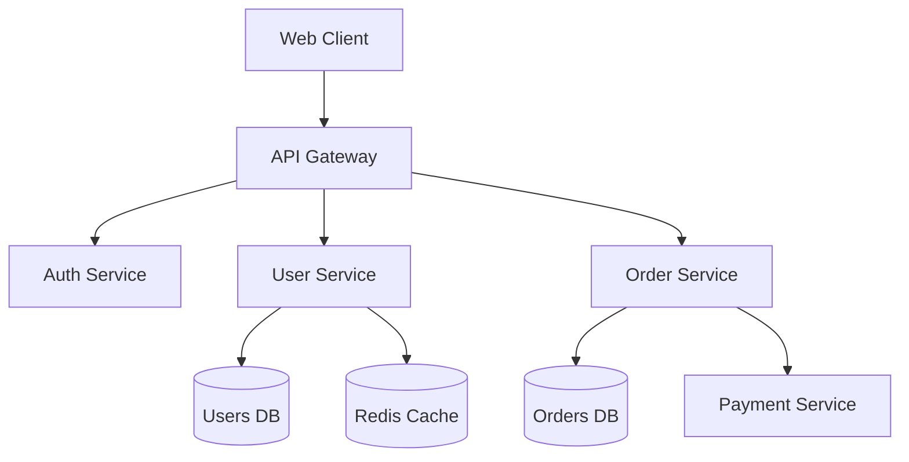

**System Components (C4):**
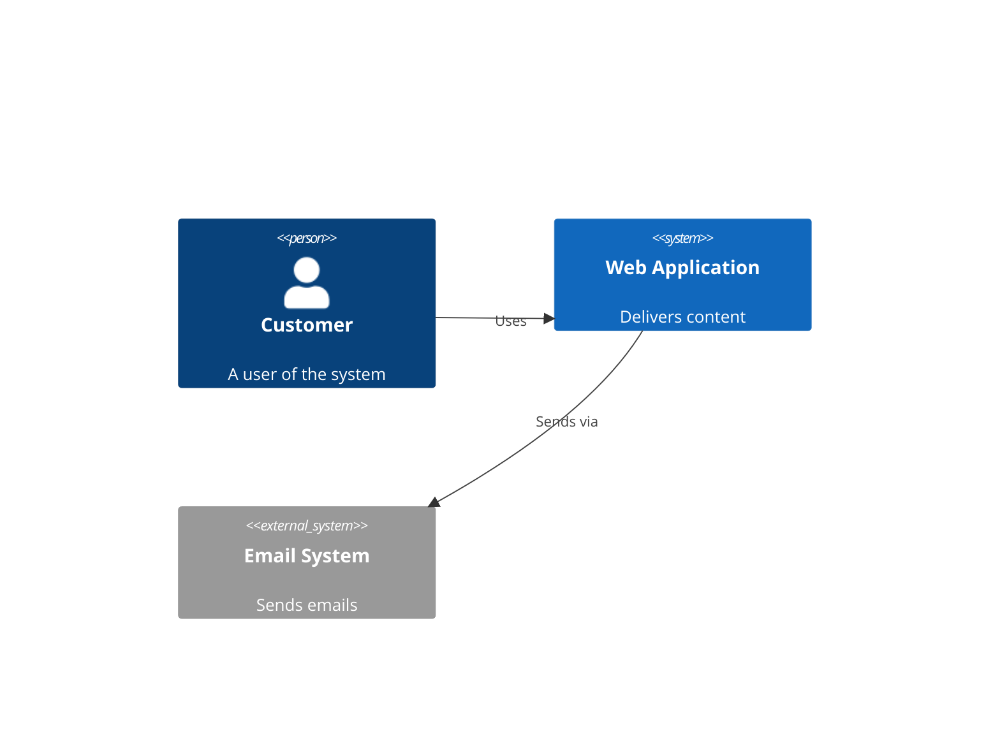

## API Documentation

**Authentication Flow:**
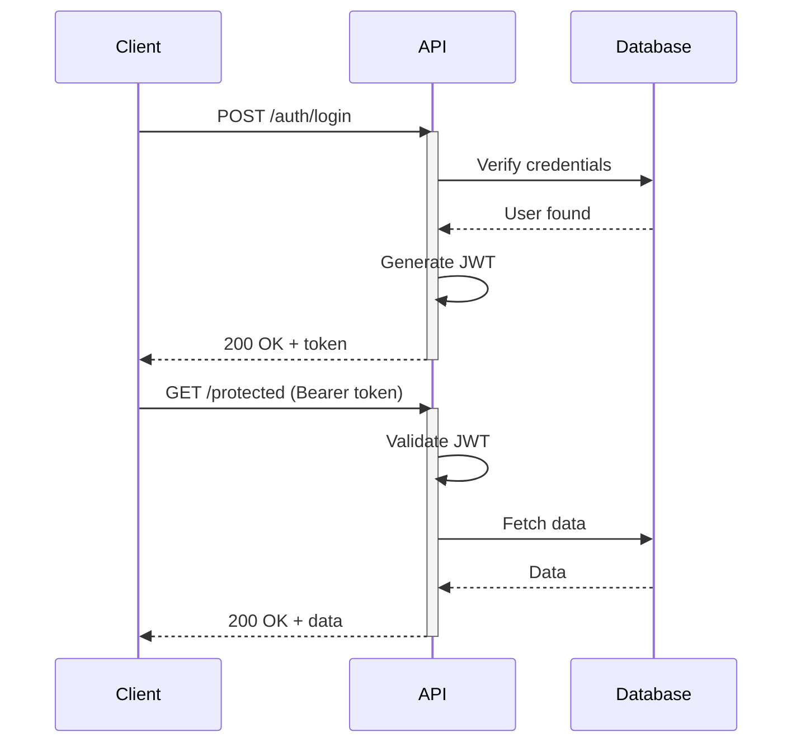

**REST API Endpoints:**
```mermaid
flowchart LR
  API[API]
  Users[/users]
  Posts[/posts]
  Comments[/comments]

  API --> Users
  API --> Posts
  API --> Comments

  Users --> U1[GET /users]
  Users --> U2[POST /users]
  Users --> U3[GET /users/:id]
  Users --> U4[PUT /users/:id]
  Users --> U5[DELETE /users/:id]
```

## Database Design

**E-Commerce Schema:**
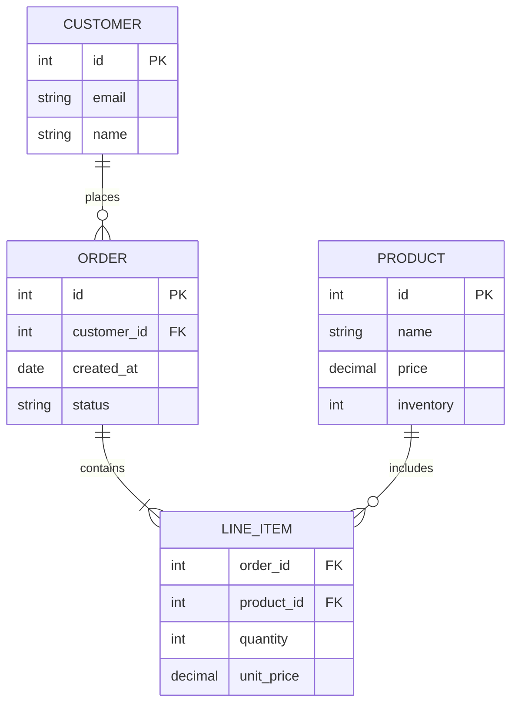

## State Machines

**Order Processing:**
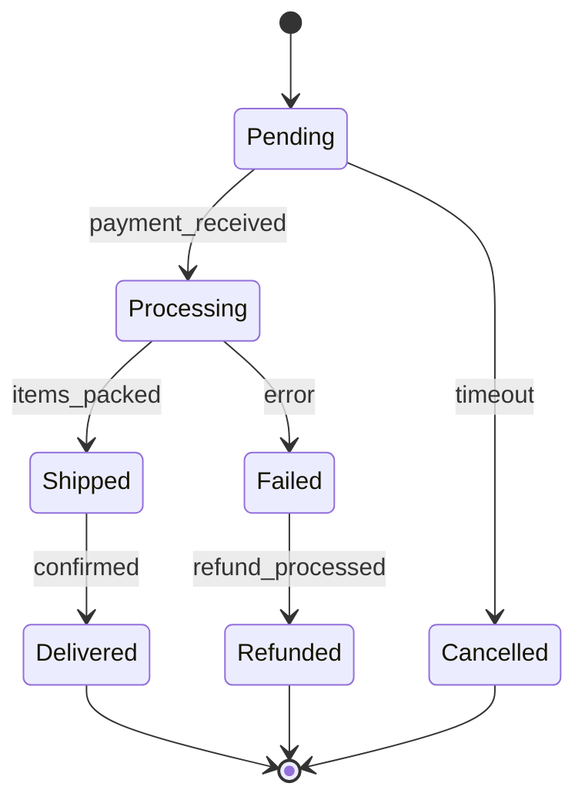

**User Authentication States:**
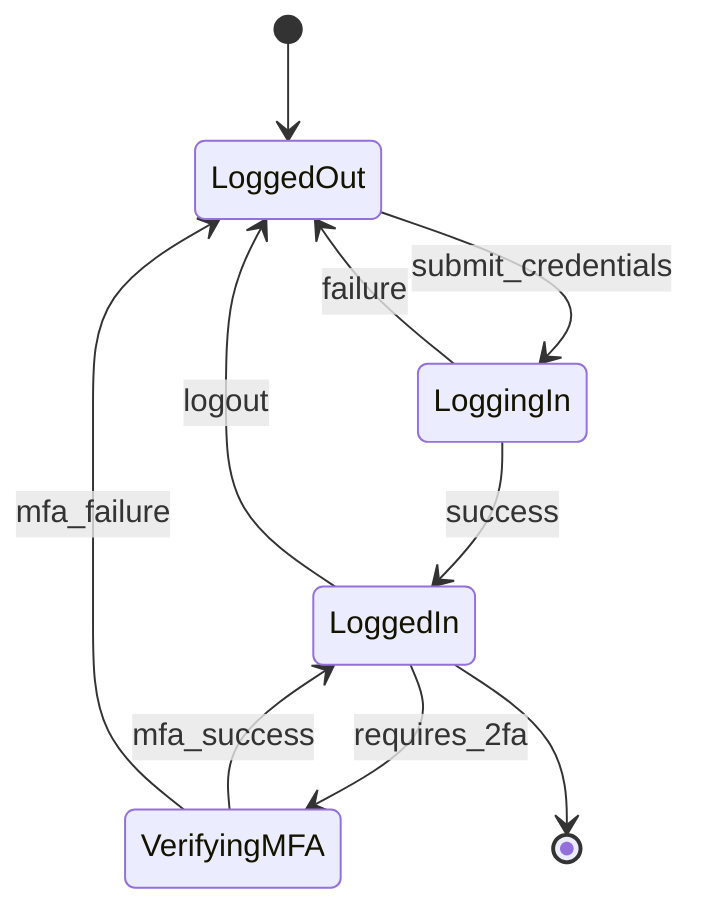

## Project Planning

**Sprint Timeline:**
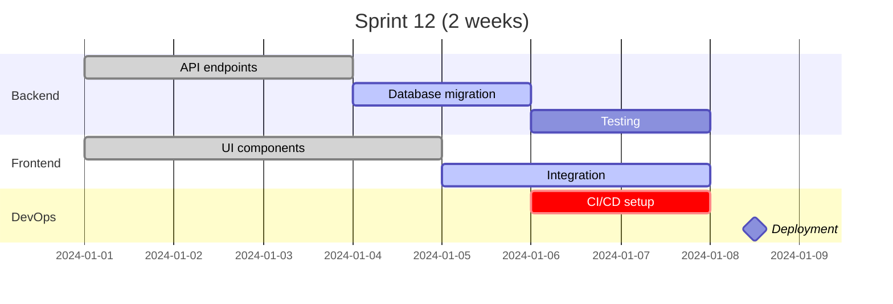

**Feature Development Journey:**
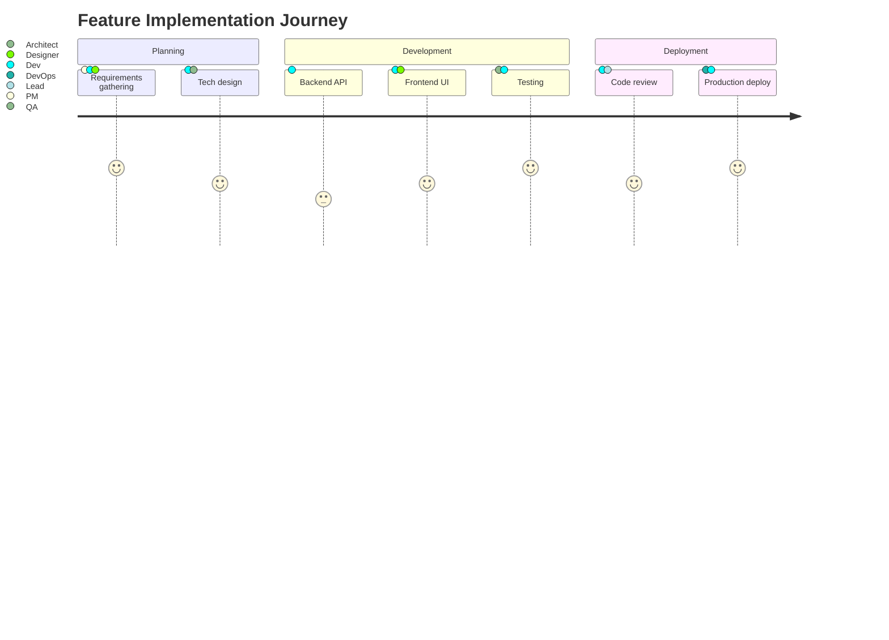

## Object-Oriented Design

**Payment System Classes:**
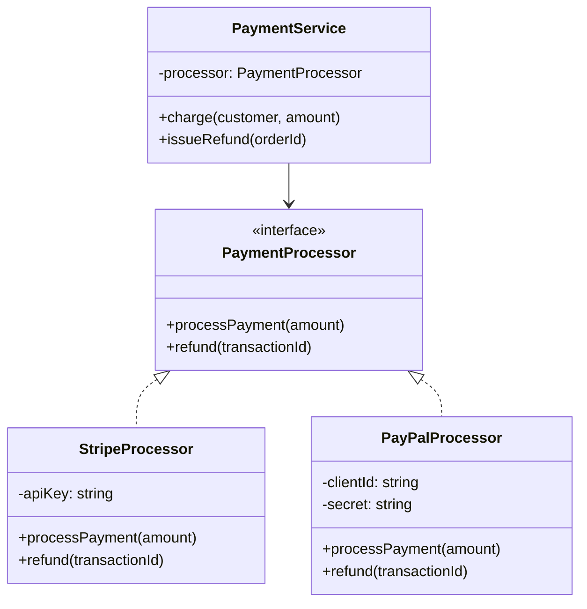

## CI/CD Pipeline

**Deployment Flow:**
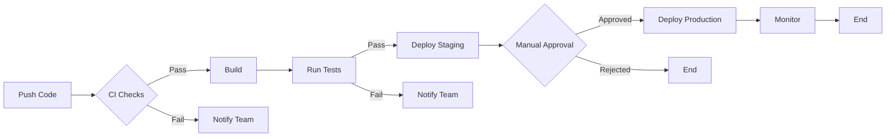

**Git Branching Strategy:**
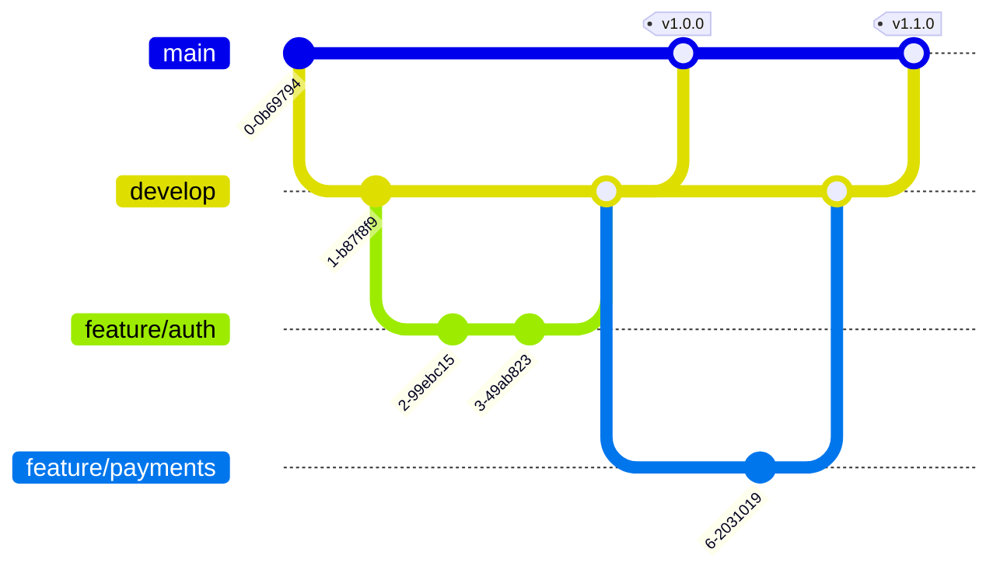

## User Experience

**Customer Onboarding:**
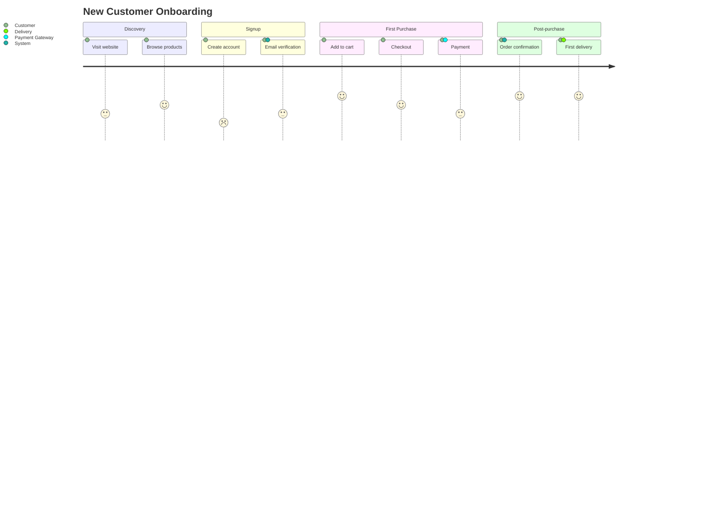

## Cloud Infrastructure

**AWS Architecture:**
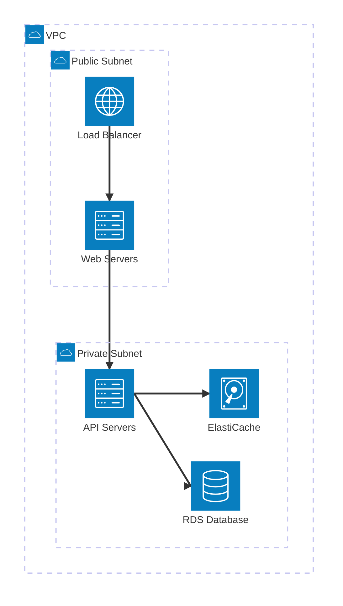

## Data Visualization

**Traffic Analysis:**
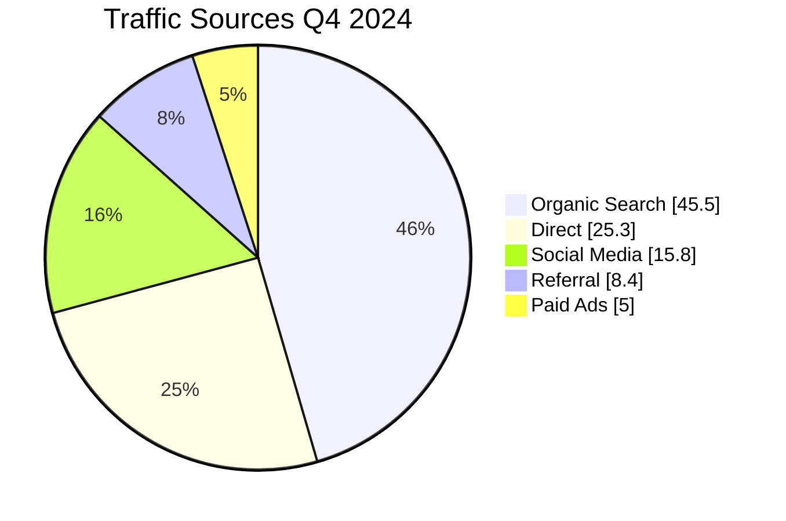

**Team Skills Assessment:**
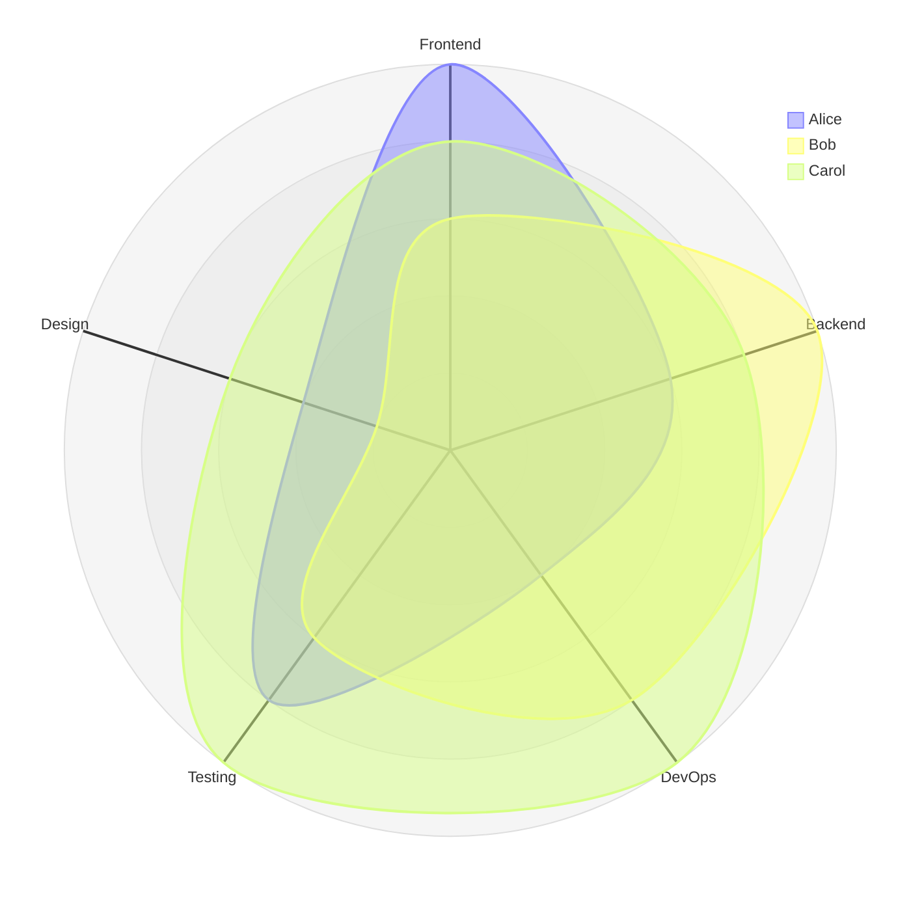

## Best Practices

**Naming Conventions:**
- Use descriptive node IDs: `userService` not `A`
- Clear labels: `[User Service]` not `[US]`
- Meaningful connections: `-->|authenticates|` not `-->`

**Styling Tips:**
```mermaid
%%{init: {'theme':'dark', 'themeVariables': {'primaryColor':'#ff6347'}}}%%
flowchart TD
  classDef important fill:#f96,stroke:#333,stroke-width:4px
  A[Critical Path]:::important
  B[Regular Task]
```

**Security:**
Use `securityLevel: 'strict'` to prevent XSS in user-generated diagrams.


### integration

# Mermaid.js Integration Patterns

JavaScript API integration, HTML embedding, and platform-specific usage.

## HTML/Browser Integration

**Basic CDN Setup:**
```html
<!DOCTYPE html>
<html>
<head>
  <script src="https://cdn.jsdelivr.net/npm/mermaid@latest/dist/mermaid.min.js"></script>
</head>
<body>
  <pre class="mermaid">
    flowchart TD
      A[Client] --> B[Load Balancer]
      B --> C[Server 1]
      B --> D[Server 2]
  </pre>
  <script>
    mermaid.initialize({ startOnLoad: true });
  </script>
</body>
</html>
```

**ES Module (Modern):**
```html
<script type="module">
  import mermaid from 'https://cdn.jsdelivr.net/npm/mermaid@latest/dist/mermaid.esm.min.mjs';
  mermaid.initialize({ startOnLoad: true });
</script>
```

## NPM/Node.js Integration

**Installation:**
```bash
npm install mermaid
# or
yarn add mermaid
```

**Import and Initialize:**
```javascript
import mermaid from 'mermaid';

mermaid.initialize({
  startOnLoad: true,
  theme: 'dark',
  securityLevel: 'strict'
});
```

**Manual Rendering:**
```javascript
import mermaid from 'mermaid';

const graphDefinition = `
  graph TD
    A[Start] --> B[Process]
    B --> C[End]
`;

const { svg } = await mermaid.render('graphId', graphDefinition);
document.getElementById('container').innerHTML = svg;
```

## React Integration

**Component Wrapper:**
```jsx
import { useEffect, useRef } from 'react';
import mermaid from 'mermaid';

function MermaidDiagram({ chart }) {
  const ref = useRef(null);

  useEffect(() => {
    mermaid.initialize({ startOnLoad: false });
    if (ref.current) {
      mermaid.render('diagram', chart).then(({ svg }) => {
        ref.current.innerHTML = svg;
      });
    }
  }, [chart]);

  return <div ref={ref} />;
}

// Usage
<MermaidDiagram chart="graph TD\nA-->B" />
```

**Next.js (App Router):**
```jsx
'use client';
import dynamic from 'next/dynamic';

const Mermaid = dynamic(() => import('./MermaidDiagram'), {
  ssr: false
});

export default function Page() {
  return <Mermaid chart="flowchart TD\nA-->B" />;
}
```

## Vue Integration

**Component:**
```vue
<template>
  <div ref="container"></div>
</template>

<script setup>
import { ref, onMounted, watch } from 'vue';
import mermaid from 'mermaid';

const props = defineProps(['chart']);
const container = ref(null);

onMounted(() => {
  mermaid.initialize({ startOnLoad: false });
  renderDiagram();
});

watch(() => props.chart, renderDiagram);

async function renderDiagram() {
  const { svg } = await mermaid.render('diagram', props.chart);
  container.value.innerHTML = svg;
}
</script>
```

## Markdown Integration

**GitHub/GitLab:**
````markdown
```mermaid
graph TD
  A[Start] --> B[End]
```
````

**MDX (Next.js/Gatsby):**
```mdx
import Mermaid from './Mermaid';

# Architecture

<Mermaid chart={`
  flowchart LR
    Client --> API
    API --> Database
`} />
```

## API Reference

**mermaid.initialize(config)**
Configure global settings.
```javascript
mermaid.initialize({
  startOnLoad: true,
  theme: 'dark',
  logLevel: 3,
  securityLevel: 'strict',
  fontFamily: 'Arial'
});
```

**mermaid.render(id, graphDefinition, config)**
Programmatically render diagram.
```javascript
const { svg, bindFunctions } = await mermaid.render(
  'uniqueId',
  'graph TD\nA-->B',
  { theme: 'forest' }
);
```

**mermaid.parse(text)**
Validate syntax without rendering.
```javascript
try {
  await mermaid.parse('graph TD\nA-->B');
  console.log('Valid');
} catch(e) {
  console.error('Invalid:', e);
}
```

**mermaid.run(config)**
Render all diagrams in page.
```javascript
await mermaid.run({
  querySelector: '.mermaid',
  suppressErrors: false
});
```

## Event Handling

**Click Events:**
```javascript
const graphDefinition = `
  flowchart TD
    A[Click me] --> B
    click A callback "Tooltip text"
`;

window.callback = function() {
  alert('Node clicked!');
};

await mermaid.render('graph', graphDefinition);
```

**Interactive URLs:**
```
flowchart TD
  A[GitHub] --> B[Docs]
  click A "https://github.com"
  click B "https://mermaid.js.org" "Open docs"
```

## Advanced Patterns

**Dynamic Theme Switching:**
```javascript
function updateTheme(isDark) {
  mermaid.initialize({
    theme: isDark ? 'dark' : 'default',
    startOnLoad: false
  });

  // Re-render all diagrams
  document.querySelectorAll('.mermaid').forEach(async (el) => {
    const code = el.textContent;
    const { svg } = await mermaid.render('id', code);
    el.innerHTML = svg;
  });
}
```

**Lazy Loading:**
```javascript
const observer = new IntersectionObserver((entries) => {
  entries.forEach(async (entry) => {
    if (entry.isIntersecting) {
      const code = entry.target.textContent;
      const { svg } = await mermaid.render('id', code);
      entry.target.innerHTML = svg;
      observer.unobserve(entry.target);
    }
  });
});

document.querySelectorAll('.mermaid').forEach(el => observer.observe(el));
```

**Server-Side Rendering (SSR):**
```javascript
import { chromium } from 'playwright';

async function renderServerSide(code) {
  const browser = await chromium.launch();
  const page = await browser.newPage();

  await page.setContent(`
    <script src="mermaid.min.js"></script>
    <div class="mermaid">${code}</div>
    <script>mermaid.initialize({ startOnLoad: true });</script>
  `);

  const svg = await page.locator('.mermaid svg').innerHTML();
  await browser.close();
  return svg;
}
```

## Platform-Specific

**Jupyter/Python:**
Use mermaid.ink API:
```python
from IPython.display import Image
diagram = "graph TD\nA-->B"
url = f"https://mermaid.ink/svg/{diagram}"
Image(url=url)
```

**VS Code:**
Install "Markdown Preview Mermaid Support" extension.

**Obsidian:**
Native support in code blocks:
````markdown
```mermaid
graph TD
  A --> B
```
````

**PowerPoint/Word:**
Use mermaid.live editor → Export → Insert image.


> **Note (Cursor):** Script execution sections in this skill are Claude Code only. Cursor uses the instructions above. Run `.claude/skills/install.sh` in Claude Code to enable full capabilities.
