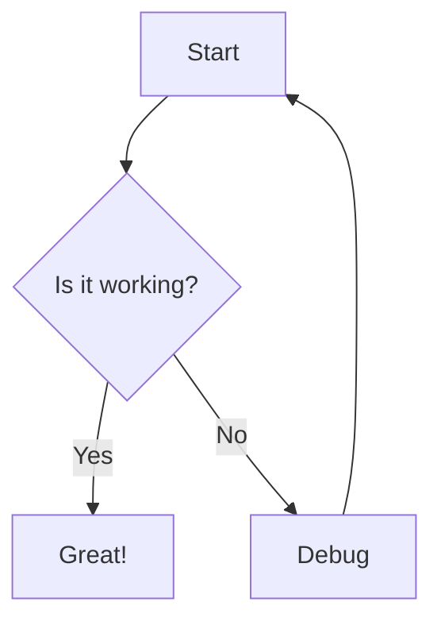
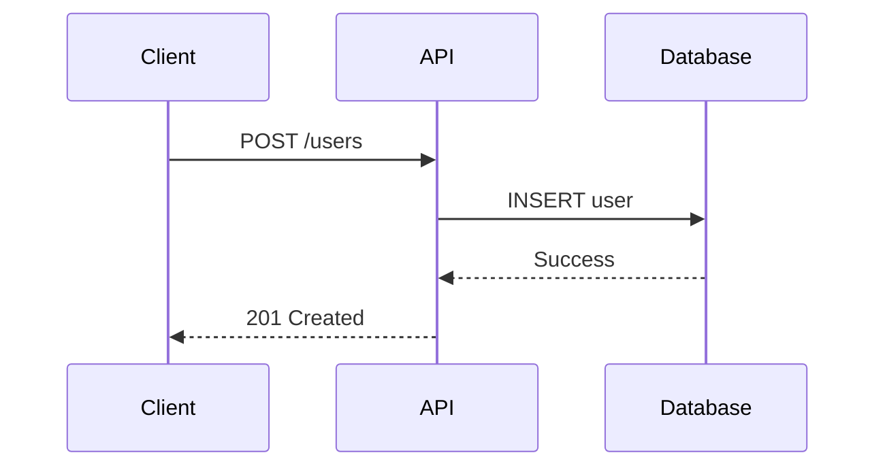

# Mintlify Documentation Builder

Mintlify is a modern documentation platform that transforms Markdown/MDX files into beautiful, interactive documentation sites.

## Quick Start

```bash
npm i -g mintlify
mint new                    # Initialize new docs
mint dev                    # Local preview
mint validate               # Validate configuration
```

## Core Concepts

**Configuration:** `docs.json` file defines theme, navigation, branding, colors, integrations.

**Themes:** 7 options - mint, maple, palm, willow, linden, almond, aspen

**Content:** MDX files with frontmatter, support for React components and Mintlify-specific components.

**Navigation:** Tabs, anchors, groups, dropdowns, products, versions, languages (28+ locales).

**Components:** 26+ built-in components for structure, API documentation, callouts, diagrams, interactivity.

## CLI Commands

```bash
mint dev                    # Local server on port 3000
mint new                    # Scaffold new docs project
mint update                 # Update Mintlify packages
mint broken-links           # Check for broken links
mint a11y                   # Accessibility audit
mint validate               # Validate docs.json config
mint openapi-check          # Validate OpenAPI specs
mint rename <old> <new>     # Rename file + update refs
mint migrate-mdx            # Migrate mint.json to docs.json
```

## Key Features

**API Documentation:** Auto-generate from OpenAPI/AsyncAPI specs, interactive playgrounds, multi-language code examples.

**AI Features:** llms.txt, skill.md, MCP support, contextual AI menu options, Discord/Slack bots.

**Customization:** Custom fonts, colors, backgrounds, logos, favicons, page modes (default|wide|custom|frame|center).

**Analytics:** GA4, PostHog, Amplitude, Clarity, Fathom, Heap, Hotjar, LogRocket, Mixpanel, Plausible, and more.

**Deployment:** Auto-deploy from GitHub/GitLab, preview deployments, custom domains, subpath hosting, Vercel/Cloudflare/AWS.

**Navigation:** Products (partition docs), versions (multiple doc versions), languages (i18n), tabs, menus, anchors.

**SEO:** Custom metatags, indexing control, redirects, sitemap generation.

## Reference Files

- `references/docs-json-configuration-reference.md` - Complete docs.json configuration
- `references/mdx-components-reference.md` - All 26+ MDX components
- `references/api-documentation-components-reference.md` - API docs and OpenAPI integration
- `references/navigation-structure-and-organization-reference.md` - Navigation patterns
- `references/deployment-and-continuous-integration-reference.md` - Deployment and CI/CD
- `references/ai-features-and-integrations-reference.md` - AI assistant, llms.txt, MCP

## Common Patterns

**Basic docs.json:**
```json
{
  "theme": "mint",
  "name": "My Docs",
  "colors": {
    "primary": "#0D9373"
  },
  "navigation": [
    {
      "group": "Getting Started",
      "pages": ["introduction", "quickstart"]
    }
  ]
}
```

**MDX page with components:**
```mdx
---
title: "Getting Started"
description: "Quick introduction"
---

<Note>Important information</Note>

<CodeGroup>
```bash
npm install
```

```python
pip install
```
</CodeGroup>

<Steps>
  <Step title="Install">Install the package</Step>
  <Step title="Configure">Set up config</Step>
</Steps>
```

## Resources

- Official docs: https://mintlify.com/docs
- GitHub: https://github.com/mintlify
- Community: Discord server for support


---

## Reference Workflows

> The following sections are inlined from the skill's reference files for Cursor compatibility.

### ai features and integrations reference

# AI Features and Integrations Reference

Complete guide for Mintlify's AI-powered features including AI assistant, llms.txt, MCP, and automation.

## AI Assistant

Built-in AI assistant for documentation search and Q&A.

### Configuration

Enable AI assistant in `docs.json`:

```json
{
  "search": {
    "prompt": "Ask me anything about our documentation..."
  }
}
```

### Features

**Conversational Search:**
- Natural language queries
- Context-aware responses
- Source citations from docs
- Follow-up questions

**Capabilities:**
- Search across all documentation
- Answer technical questions
- Provide code examples
- Navigate to relevant pages
- Suggest related content

### Customization

**Custom Prompt:**
```json
{
  "search": {
    "prompt": "How can I help you with the API?",
    "placeholder": "Ask about authentication, endpoints, or SDKs..."
  }
}
```

**Search Scope:**
```json
{
  "search": {
    "scope": ["api", "guides"],
    "exclude": ["internal", "deprecated"]
  }
}
```

## llms.txt

Optimize documentation for LLM consumption and indexing.

### What is llms.txt?

Special file format that makes documentation machine-readable for AI models:
- Structured content for LLMs
- Optimized token usage
- Hierarchical organization
- Metadata for context

### Auto-Generation

Mintlify automatically generates `llms.txt` from your documentation.

**Access:** `https://docs.example.com/llms.txt`

### Manual Configuration

Customize llms.txt generation:

```json
{
  "ai": {
    "llmsTxt": {
      "enabled": true,
      "include": ["introduction", "api/*", "guides/*"],
      "exclude": ["internal/*", "deprecated/*"],
      "format": "structured"
    }
  }
}
```

### llms.txt Format

Generated file structure:

```
# Product Name Documentation

## Overview
Brief description of product and documentation

## Getting Started
> /introduction
Quick introduction to get started

> /quickstart
Step-by-step quickstart guide

## API Reference
> /api/authentication
Authentication methods and API keys

> /api/users
User management endpoints

> /api/posts
Post creation and management

## Guides
> /guides/deployment
Deployment guide for production

> /guides/security
Security best practices
```

### Use Cases

**Feed to LLMs:**
- Provide entire docs context to ChatGPT, Claude, etc.
- Enable AI to answer questions about your product
- Generate code examples based on documentation

**RAG Systems:**
- Index for retrieval-augmented generation
- Build custom AI assistants
- Create documentation chatbots

## skill.md

Make documentation agent-ready with skill definitions.

### What is skill.md?

Defines your API/product as a "skill" that AI agents can execute:
- Function signatures
- Parameter schemas
- Authentication requirements
- Example usage

### Generation

Mintlify auto-generates `skill.md` from OpenAPI specs.

**Access:** `https://docs.example.com/skill.md`

### Format

```markdown
# API Skills

## Create User

Create a new user account

**Function:** `createUser`

**Parameters:**
- `email` (string, required) - User email address
- `name` (string, required) - Full name
- `password` (string, required) - Password (min 8 chars)

**Returns:** User object with ID and timestamps

**Example:**
```json
{
  "email": "user@example.com",
  "name": "John Doe",
  "password": "SecurePass123"
}
```

**Response:**
```json
{
  "id": "usr_abc123",
  "email": "user@example.com",
  "name": "John Doe",
  "created_at": "2024-01-15T10:30:00Z"
}
```

## List Users

Retrieve paginated list of users

**Function:** `listUsers`

**Parameters:**
- `page` (number, optional) - Page number (default: 1)
- `limit` (number, optional) - Items per page (default: 10)
- `sort` (string, optional) - Sort field (default: created_at)

**Returns:** Array of user objects with pagination metadata
```

### Configuration

Customize skill.md generation:

```json
{
  "ai": {
    "skillMd": {
      "enabled": true,
      "includeExamples": true,
      "includeErrors": true,
      "format": "agent-ready"
    }
  }
}
```

### Use Cases

**AI Agents:**
- Claude Code, Cursor, Windsurf
- Auto-discover API capabilities
- Generate correct API calls
- Handle errors appropriately

**Documentation Tools:**
- Auto-complete in IDEs
- API client generation
- Testing frameworks

## MCP (Model Context Protocol)

Expose documentation through Model Context Protocol for AI tools.

### What is MCP?

Protocol that allows AI tools to access and interact with documentation:
- Standardized interface
- Real-time doc access
- Function calling support
- Resource discovery

### Configuration

Enable MCP in `docs.json`:

```json
{
  "contextual": {
    "options": ["mcp"]
  },
  "ai": {
    "mcp": {
      "enabled": true,
      "endpoint": "/mcp",
      "capabilities": ["read", "search", "navigate"]
    }
  }
}
```

### MCP Capabilities

**Resources:**
- List all documentation pages
- Read page content
- Access metadata

**Search:**
- Full-text search
- Semantic search
- Filter by section

**Navigation:**
- Get navigation structure
- Find related pages
- Access breadcrumbs

### MCP Client Integration

**Claude Desktop:**
```json
{
  "mcpServers": {
    "docs": {
      "url": "https://docs.example.com/mcp",
      "apiKey": "optional-key"
    }
  }
}
```

**VSCode with Continue:**
```json
{
  "contextProviders": [
    {
      "name": "docs",
      "type": "mcp",
      "url": "https://docs.example.com/mcp"
    }
  ]
}
```

## Contextual Menu Options

Quick access to AI tools from documentation pages.

### Configuration

```json
{
  "contextual": {
    "options": [
      "copy",
      "view",
      "chatgpt",
      "claude",
      "perplexity",
      "mcp",
      "cursor",
      "vscode"
    ]
  }
}
```

### Available Options

**copy** - Copy page content to clipboard
```
Copies: Markdown content with frontmatter
Use: Paste into any editor or tool
```

**view** - View raw markdown source
```
Opens: Raw .mdx file content
Use: See exact markdown structure
```

**chatgpt** - Open in ChatGPT
```
Action: Opens ChatGPT with page context
Prompt: "Explain this documentation: [content]"
```

**claude** - Open in Claude
```
Action: Opens Claude.ai with page context
Prompt: "Help me understand: [content]"
```

**perplexity** - Open in Perplexity
```
Action: Search Perplexity with page topic
Query: Key concepts from page
```

**mcp** - Copy MCP resource URI
```
Copies: MCP resource identifier
Use: Reference in MCP-enabled tools
```

**cursor** - Open in Cursor editor
```
Action: cursor://open?url=[page-url]
Use: Edit in Cursor IDE
```

**vscode** - Open in VS Code
```
Action: vscode://file/[local-path]
Use: Edit in VS Code
```

### Custom Options

Add custom contextual menu items:

```json
{
  "contextual": {
    "custom": [
      {
        "name": "Open in Notion",
        "icon": "notion",
        "url": "https://notion.so/import?url={pageUrl}"
      },
      {
        "name": "Translate",
        "icon": "language",
        "url": "https://translate.google.com/?text={content}"
      }
    ]
  }
}
```

## Discord Bot

AI-powered Discord bot for documentation queries.

### Setup

1. **Enable Bot:**
   - Go to Mintlify dashboard
   - Navigate to Integrations > Discord
   - Click "Enable Discord Bot"

2. **Add to Server:**
   - Copy bot invite URL
   - Open in browser
   - Select Discord server
   - Authorize permissions

3. **Configure:**
   ```json
   {
     "integrations": {
       "discord": {
         "enabled": true,
         "channelIds": ["123456789", "987654321"],
         "prefix": "!docs",
         "permissions": ["read", "search"]
       }
     }
   }
   ```

### Usage

**Search Documentation:**
```
!docs search authentication
!docs how to create API key
!docs what is rate limiting
```

**Get Page:**
```
!docs page introduction
!docs link api/users
```

**Ask Questions:**
```
!docs What authentication methods are supported?
!docs How do I paginate results?
!docs Show me example of creating a user
```

### Bot Features

- Natural language search
- Code example formatting
- Inline documentation links
- Contextual answers
- Source citations
- Slash commands support

## Slack Bot

AI assistant for Slack workspaces.

### Setup

1. **Enable Integration:**
   - Go to Mintlify dashboard
   - Navigate to Integrations > Slack
   - Click "Add to Slack"

2. **Authorize:**
   - Select workspace
   - Approve permissions
   - Configure channels

3. **Configuration:**
   ```json
   {
     "integrations": {
       "slack": {
         "enabled": true,
         "channels": ["#engineering", "#support"],
         "notifyUpdates": true,
         "dailyDigest": true
       }
     }
   }
   ```

### Usage

**Ask Questions:**
```
@DocsBot How do I authenticate API requests?
@DocsBot Show me user creation example
@DocsBot What's the rate limit for /users endpoint?
```

**Search:**
```
/docs search webhooks
/docs find deployment guide
```

**Get Updates:**
```
/docs subscribe api-updates
/docs notifications on
```

### Features

- Conversational interface
- Code snippet formatting
- Direct message support
- Channel subscriptions
- Documentation update notifications
- Daily digest summaries

## Agent Automation

AI agent for automated documentation tasks.

### Configuration

```json
{
  "ai": {
    "agent": {
      "enabled": true,
      "capabilities": [
        "suggest-improvements",
        "detect-outdated",
        "generate-examples",
        "fix-broken-links"
      ],
      "schedule": "daily",
      "notifications": {
        "slack": "#docs-updates",
        "email": "team@example.com"
      }
    }
  }
}
```

### Capabilities

**Suggest Improvements:**
- Identify unclear explanations
- Suggest better wording
- Recommend additional examples
- Highlight missing sections

**Detect Outdated Content:**
- Compare with codebase
- Check API version compatibility
- Flag deprecated features
- Identify stale examples

**Generate Examples:**
- Auto-generate code examples
- Create usage scenarios
- Build tutorial content
- Produce troubleshooting guides

**Fix Broken Links:**
- Scan for 404s
- Update redirected URLs
- Fix internal references
- Validate external links

### Slack Integration

Receive agent suggestions in Slack:

```
Agent Report - Daily Digest

Suggestions (3):
- Add Python example to /api/authentication
- Update rate limits in /api/overview (changed in v2.5)
- Clarify webhook signature verification in /webhooks

Broken Links (1):
- /guides/deployment links to removed page /setup

Outdated Content (2):
- /api/users references deprecated `user_type` field
- /quickstart shows old authentication method
```

### Workflow Automation

Configure automated workflows:

```json
{
  "ai": {
    "workflows": [
      {
        "name": "Weekly Review",
        "trigger": "schedule",
        "schedule": "0 9 * * MON",
        "actions": [
          "detect-outdated",
          "broken-links",
          "suggest-improvements"
        ],
        "output": "slack"
      },
      {
        "name": "PR Review",
        "trigger": "pull_request",
        "actions": [
          "validate-changes",
          "suggest-examples",
          "check-consistency"
        ],
        "output": "github"
      }
    ]
  }
}
```

## AI API Access

Programmatic access to AI features.

### Endpoints

**Search:**
```bash
curl -X POST https://api.mintlify.com/v1/ai/search \
  -H "Authorization: Bearer YOUR_API_KEY" \
  -H "Content-Type: application/json" \
  -d '{
    "query": "How do I authenticate?",
    "scope": "api"
  }'
```

**Ask Question:**
```bash
curl -X POST https://api.mintlify.com/v1/ai/ask \
  -H "Authorization: Bearer YOUR_API_KEY" \
  -H "Content-Type: application/json" \
  -d '{
    "question": "What are the rate limits?",
    "context": ["api/overview", "api/rate-limits"]
  }'
```

**Generate Example:**
```bash
curl -X POST https://api.mintlify.com/v1/ai/generate \
  -H "Authorization: Bearer YOUR_API_KEY" \
  -H "Content-Type: application/json" \
  -d '{
    "type": "code_example",
    "endpoint": "POST /users",
    "language": "python"
  }'
```

### SDK Usage

**JavaScript:**
```javascript
import { MintlifyAI } from '@mintlify/ai';

const ai = new MintlifyAI({ apiKey: 'YOUR_API_KEY' });

const answer = await ai.ask({
  question: 'How do I authenticate API requests?',
  context: ['api/authentication']
});

console.log(answer.response);
console.log(answer.sources);
```

**Python:**
```python
from mintlify import MintlifyAI

ai = MintlifyAI(api_key='YOUR_API_KEY')

answer = ai.ask(
    question='How do I authenticate API requests?',
    context=['api/authentication']
)

print(answer.response)
print(answer.sources)
```

## Analytics and Insights

Track AI feature usage and effectiveness.

### AI Metrics

**Search Analytics:**
- Popular queries
- Query success rate
- Zero-result searches
- Click-through rates

**Question Analytics:**
- Most asked questions
- Response accuracy
- User satisfaction ratings
- Follow-up questions

**Usage Patterns:**
- Peak usage times
- User segments
- Feature adoption
- Integration usage

### Dashboard

View AI analytics in Mintlify dashboard:
- AI > Analytics
- Filter by date range
- Export reports
- Track trends

### Configuration

```json
{
  "ai": {
    "analytics": {
      "enabled": true,
      "trackQueries": true,
      "trackClicks": true,
      "collectFeedback": true
    }
  }
}
```


### api documentation components reference

# API Documentation Components Reference

Complete guide for documenting APIs with Mintlify using OpenAPI/AsyncAPI specs and API components.

## OpenAPI Integration

### Automatic Page Generation

Use OpenAPI frontmatter to auto-generate API documentation from OpenAPI specs.

```mdx
---
title: "Get User"
openapi: "GET /users/{id}"
---
```

Mintlify automatically extracts:
- Request parameters (path, query, header, body)
- Request examples in multiple languages
- Response schemas
- Response examples
- Authentication requirements

### OpenAPI Configuration

Configure in `docs.json`:

```json
{
  "api": {
    "openapi": "/openapi.yaml",
    "params": {
      "expanded": true
    },
    "playground": {
      "display": "interactive",
      "proxy": "https://api.example.com"
    },
    "examples": {
      "languages": ["bash", "python", "javascript", "go", "ruby", "php", "java"],
      "defaults": {
        "bash": "curl",
        "python": "requests"
      },
      "prefill": {
        "apiKey": "your-api-key",
        "baseUrl": "https://api.example.com"
      },
      "autogenerate": true
    }
  }
}
```

**Configuration options:**
- `openapi` - Path to OpenAPI spec file (YAML or JSON)
- `params.expanded` - Expand parameter details by default
- `playground.display` - API playground mode (interactive, simple, none)
- `playground.proxy` - Proxy URL for API requests
- `examples.languages` - Supported code example languages
- `examples.defaults` - Default library per language
- `examples.prefill` - Pre-fill values in examples
- `examples.autogenerate` - Auto-generate examples from spec

### Multiple OpenAPI Specs

```json
{
  "api": {
    "openapi": [
      "/specs/v1.yaml",
      "/specs/v2.yaml"
    ]
  }
}
```

### OpenAPI Validation

```bash
mint openapi-check
```

Validates OpenAPI specs for:
- Syntax errors
- Schema compliance
- Missing required fields
- Invalid references

## AsyncAPI Integration

Document asynchronous APIs (WebSockets, message queues, event streams).

```json
{
  "api": {
    "asyncapi": "/asyncapi.yaml"
  }
}
```

Use in frontmatter:

```mdx
---
title: "User Events"
asyncapi: "subscribe user.created"
---
```

## ParamField Component

Document API parameters with detailed type information.

### Path Parameters

```mdx
<ParamField path="userId" type="string" required>
  The unique identifier of the user
</ParamField>

<ParamField path="postId" type="integer" required>
  The ID of the post to retrieve
</ParamField>
```

### Query Parameters

```mdx
<ParamField query="page" type="number" default="1">
  Page number for pagination (1-indexed)
</ParamField>

<ParamField query="limit" type="number" default="10">
  Number of items per page (max 100)
</ParamField>

<ParamField query="sort" type="string" default="created_at">
  Field to sort by
</ParamField>

<ParamField query="order" type="string" default="desc">
  Sort order (asc or desc)
</ParamField>
```

### Body Parameters

```mdx
<ParamField body="email" type="string" required>
  User's email address (must be unique)
</ParamField>

<ParamField body="name" type="string" required>
  Full name of the user
</ParamField>

<ParamField body="age" type="number">
  User's age (must be 18 or older)
</ParamField>

<ParamField body="settings" type="object">
  User preferences and settings
</ParamField>
```

### Header Parameters

```mdx
<ParamField header="Authorization" type="string" required>
  Bearer token for authentication

  Format: `Bearer YOUR_API_KEY`
</ParamField>

<ParamField header="Content-Type" type="string" default="application/json">
  Content type of the request body
</ParamField>

<ParamField header="X-Request-ID" type="string">
  Unique identifier for request tracing
</ParamField>
```

### Enum Parameters

```mdx
<ParamField
  query="status"
  type="string"
  default="active"
  enum={["active", "inactive", "pending", "suspended"]}
  enumDescriptions={{
    active: "User account is active and fully functional",
    inactive: "User account is temporarily disabled",
    pending: "User registration awaiting email verification",
    suspended: "User account suspended due to policy violation"
  }}
>
  Filter users by account status
</ParamField>
```

### Array Parameters

```mdx
<ParamField query="tags" type="array">
  Array of tag IDs to filter by

  Example: `?tags=1,2,3`
</ParamField>

<ParamField body="roles" type="string[]" required>
  Array of role identifiers to assign to the user
</ParamField>
```

### Nested Object Parameters

```mdx
<ParamField body="address" type="object">
  User's address information

  <Expandable title="address properties">
    <ParamField body="street" type="string" required>
      Street address
    </ParamField>
    <ParamField body="city" type="string" required>
      City name
    </ParamField>
    <ParamField body="state" type="string">
      State or province
    </ParamField>
    <ParamField body="postal_code" type="string" required>
      Postal/ZIP code
    </ParamField>
    <ParamField body="country" type="string" required>
      ISO 3166-1 alpha-2 country code
    </ParamField>
  </Expandable>
</ParamField>
```

## ResponseField Component

Document API response fields with type information.

### Basic Response Fields

```mdx
<ResponseField name="id" type="string" required>
  Unique identifier of the user
</ResponseField>

<ResponseField name="email" type="string" required>
  User's email address
</ResponseField>

<ResponseField name="created_at" type="timestamp" required>
  ISO 8601 timestamp of when the user was created
</ResponseField>

<ResponseField name="is_verified" type="boolean" default="false">
  Whether the user's email has been verified
</ResponseField>
```

### Nested Response Objects

```mdx
<ResponseField name="user" type="object">
  User information object

  <Expandable title="user properties">
    <ResponseField name="id" type="string" required>
      User ID
    </ResponseField>
    <ResponseField name="name" type="string" required>
      Full name
    </ResponseField>
    <ResponseField name="email" type="string" required>
      Email address
    </ResponseField>
    <ResponseField name="profile" type="object">
      Extended profile information

      <Expandable title="profile properties">
        <ResponseField name="bio" type="string">
          User biography
        </ResponseField>
        <ResponseField name="avatar_url" type="string">
          Profile picture URL
        </ResponseField>
        <ResponseField name="location" type="string">
          User's location
        </ResponseField>
      </Expandable>
    </ResponseField>
  </Expandable>
</ResponseField>
```

### Array Responses

```mdx
<ResponseField name="users" type="array">
  Array of user objects

  <Expandable title="user object properties">
    <ResponseField name="id" type="string">
      User ID
    </ResponseField>
    <ResponseField name="name" type="string">
      User name
    </ResponseField>
    <ResponseField name="email" type="string">
      Email address
    </ResponseField>
  </Expandable>
</ResponseField>

<ResponseField name="meta" type="object">
  Pagination metadata

  <Expandable title="meta properties">
    <ResponseField name="page" type="number">
      Current page number
    </ResponseField>
    <ResponseField name="per_page" type="number">
      Items per page
    </ResponseField>
    <ResponseField name="total" type="number">
      Total number of items
    </ResponseField>
  </Expandable>
</ResponseField>
```

## Request Examples

Show API request examples in multiple programming languages.

### Basic Request Example

```mdx
<RequestExample>
```bash cURL
curl -X GET https://api.example.com/users/123 \
  -H "Authorization: Bearer YOUR_API_KEY"
```

```python Python
import requests

response = requests.get(
    "https://api.example.com/users/123",
    headers={"Authorization": "Bearer YOUR_API_KEY"}
)

print(response.json())
```

```javascript JavaScript
const response = await fetch("https://api.example.com/users/123", {
  method: "GET",
  headers: {
    "Authorization": "Bearer YOUR_API_KEY"
  }
});

const data = await response.json();
console.log(data);
```

```go Go
package main

import (
    "fmt"
    "io"
    "net/http"
)

func main() {
    client := &http.Client{}
    req, _ := http.NewRequest("GET", "https://api.example.com/users/123", nil)
    req.Header.Set("Authorization", "Bearer YOUR_API_KEY")

    resp, _ := client.Do(req)
    defer resp.Body.Close()

    body, _ := io.ReadAll(resp.Body)
    fmt.Println(string(body))
}
```
</RequestExample>
```

### POST Request with Body

```mdx
<RequestExample>
```bash cURL
curl -X POST https://api.example.com/users \
  -H "Authorization: Bearer YOUR_API_KEY" \
  -H "Content-Type: application/json" \
  -d '{
    "email": "user@example.com",
    "name": "John Doe",
    "age": 30
  }'
```

```python Python
import requests

data = {
    "email": "user@example.com",
    "name": "John Doe",
    "age": 30
}

response = requests.post(
    "https://api.example.com/users",
    headers={"Authorization": "Bearer YOUR_API_KEY"},
    json=data
)

print(response.json())
```

```javascript JavaScript
const data = {
  email: "user@example.com",
  name: "John Doe",
  age: 30
};

const response = await fetch("https://api.example.com/users", {
  method: "POST",
  headers: {
    "Authorization": "Bearer YOUR_API_KEY",
    "Content-Type": "application/json"
  },
  body: JSON.stringify(data)
});

const result = await response.json();
console.log(result);
```

```ruby Ruby
require 'net/http'
require 'json'

uri = URI('https://api.example.com/users')
request = Net::HTTP::Post.new(uri)
request['Authorization'] = 'Bearer YOUR_API_KEY'
request['Content-Type'] = 'application/json'
request.body = {
  email: 'user@example.com',
  name: 'John Doe',
  age: 30
}.to_json

response = Net::HTTP.start(uri.hostname, uri.port, use_ssl: true) do |http|
  http.request(request)
end

puts response.body
```
</RequestExample>
```

## Response Examples

Show API response examples for different scenarios.

### Success and Error Responses

```mdx
<ResponseExample>
```json Success (200)
{
  "id": "usr_abc123",
  "email": "user@example.com",
  "name": "John Doe",
  "created_at": "2024-01-15T10:30:00Z",
  "is_verified": true
}
```

```json Error (400)
{
  "error": {
    "code": "validation_error",
    "message": "Invalid email format",
    "details": {
      "field": "email",
      "value": "invalid-email"
    }
  }
}
```

```json Error (401)
{
  "error": {
    "code": "unauthorized",
    "message": "Invalid or expired API key"
  }
}
```

```json Error (404)
{
  "error": {
    "code": "not_found",
    "message": "User with ID 'usr_abc123' not found"
  }
}
```
</ResponseExample>
```

### Paginated Response

```mdx
<ResponseExample>
```json Success (200)
{
  "data": [
    {
      "id": "usr_001",
      "name": "Alice Smith",
      "email": "alice@example.com"
    },
    {
      "id": "usr_002",
      "name": "Bob Jones",
      "email": "bob@example.com"
    }
  ],
  "meta": {
    "page": 1,
    "per_page": 10,
    "total": 45,
    "total_pages": 5
  },
  "links": {
    "first": "https://api.example.com/users?page=1",
    "last": "https://api.example.com/users?page=5",
    "next": "https://api.example.com/users?page=2",
    "prev": null
  }
}
```
</ResponseExample>
```

## API Playground

Interactive API playground modes.

### Interactive Mode (default)

Full interactive playground with request builder and live testing.

```json
{
  "api": {
    "playground": {
      "display": "interactive"
    }
  }
}
```

Features:
- Live API requests from browser
- Parameter input fields
- Authentication management
- Response preview
- Copy as code snippets

### Simple Mode

Simplified playground with basic request/response display.

```json
{
  "api": {
    "playground": {
      "display": "simple"
    }
  }
}
```

### Disabled Playground

Hide playground completely.

```json
{
  "api": {
    "playground": {
      "display": "none"
    }
  }
}
```

### Playground Proxy

Route API requests through proxy server (bypass CORS).

```json
{
  "api": {
    "playground": {
      "proxy": "https://cors-proxy.example.com"
    }
  }
}
```

## Code Example Languages

Configure supported languages for code examples.

```json
{
  "api": {
    "examples": {
      "languages": [
        "bash",
        "python",
        "javascript",
        "typescript",
        "go",
        "ruby",
        "php",
        "java",
        "swift",
        "csharp",
        "kotlin",
        "rust"
      ]
    }
  }
}
```

### Default Libraries

Set default library/method per language.

```json
{
  "api": {
    "examples": {
      "defaults": {
        "bash": "curl",
        "python": "requests",
        "javascript": "fetch",
        "go": "http"
      }
    }
  }
}
```

### Prefill Values

Pre-fill common values in code examples.

```json
{
  "api": {
    "examples": {
      "prefill": {
        "apiKey": "sk_test_abc123",
        "baseUrl": "https://api.example.com",
        "userId": "usr_example"
      }
    }
  }
}
```

Values replace placeholders in examples:
- `{apiKey}` → `sk_test_abc123`
- `{baseUrl}` → `https://api.example.com`
- `{userId}` → `usr_example`

### Auto-generate Examples

Automatically generate code examples from OpenAPI spec.

```json
{
  "api": {
    "examples": {
      "autogenerate": true
    }
  }
}
```

## SDK Integration

### Speakeasy SDK

Integrate Speakeasy-generated SDKs.

```mdx
---
title: "Create User"
openapi: "POST /users"
---

<CodeGroup>
```typescript TypeScript SDK
import { SDK } from '@company/sdk';

const sdk = new SDK({ apiKey: 'YOUR_API_KEY' });

const user = await sdk.users.create({
  email: 'user@example.com',
  name: 'John Doe'
});
```

```python Python SDK
from company_sdk import SDK

sdk = SDK(api_key='YOUR_API_KEY')

user = sdk.users.create(
    email='user@example.com',
    name='John Doe'
)
```
</CodeGroup>
```

### Stainless SDK

Integrate Stainless-generated SDKs.

```mdx
<CodeGroup>
```typescript TypeScript SDK
import { CompanyAPI } from 'company-api';

const client = new CompanyAPI({
  apiKey: process.env.COMPANY_API_KEY
});

const user = await client.users.create({
  email: 'user@example.com',
  name: 'John Doe'
});
```
</CodeGroup>
```

## Complete API Endpoint Example

Full example of documented API endpoint.

```mdx
---
title: "Create User"
description: "Create a new user account"
openapi: "POST /users"
---

Creates a new user with the provided information. Email must be unique.

## Request

<ParamField body="email" type="string" required>
  User's email address (must be unique)
</ParamField>

<ParamField body="name" type="string" required>
  Full name of the user
</ParamField>

<ParamField body="password" type="string" required>
  User's password (minimum 8 characters)
</ParamField>

<ParamField body="role" type="string" default="user" enum={["user", "admin", "moderator"]}>
  User's role in the system
</ParamField>

## Response

<ResponseField name="id" type="string" required>
  Unique identifier of the created user
</ResponseField>

<ResponseField name="email" type="string" required>
  User's email address
</ResponseField>

<ResponseField name="name" type="string" required>
  User's full name
</ResponseField>

<ResponseField name="role" type="string" required>
  User's assigned role
</ResponseField>

<ResponseField name="created_at" type="timestamp" required>
  ISO 8601 timestamp of creation
</ResponseField>

<RequestExample>
```bash cURL
curl -X POST https://api.example.com/users \
  -H "Authorization: Bearer YOUR_API_KEY" \
  -H "Content-Type: application/json" \
  -d '{
    "email": "john@example.com",
    "name": "John Doe",
    "password": "SecurePass123",
    "role": "user"
  }'
```

```python Python
import requests

response = requests.post(
    "https://api.example.com/users",
    headers={"Authorization": "Bearer YOUR_API_KEY"},
    json={
        "email": "john@example.com",
        "name": "John Doe",
        "password": "SecurePass123",
        "role": "user"
    }
)
```
</RequestExample>

<ResponseExample>
```json Success (201)
{
  "id": "usr_abc123",
  "email": "john@example.com",
  "name": "John Doe",
  "role": "user",
  "created_at": "2024-01-15T10:30:00Z"
}
```

```json Error (400)
{
  "error": {
    "code": "validation_error",
    "message": "Email already exists",
    "field": "email"
  }
}
```
</ResponseExample>
```


### deployment and continuous integration reference

# Deployment and Continuous Integration Reference

Complete guide for deploying Mintlify documentation with various hosting platforms and CI/CD pipelines.

## Auto-Deploy from Git

Mintlify automatically deploys from connected Git repositories.

### GitHub Integration

1. **Connect Repository:**
   - Go to Mintlify dashboard
   - Click "Connect Repository"
   - Authorize GitHub access
   - Select repository

2. **Configure Branch:**
   - Set main branch (e.g., `main`, `master`)
   - Optionally enable preview deployments for PRs

3. **Auto-Deploy:**
   - Push to main branch triggers production deployment
   - Pull requests trigger preview deployments
   - Deployment status shows in GitHub checks

### GitLab Integration

1. **Connect Repository:**
   - Go to Mintlify dashboard
   - Select GitLab integration
   - Authorize GitLab access
   - Choose repository and branch

2. **Deploy on Push:**
   - Commits to configured branch auto-deploy
   - Merge requests can trigger previews

### GitHub Enterprise Server

For self-hosted GitHub instances:

1. **Configuration:**
   - Provide GitHub Enterprise Server URL
   - Generate personal access token with repo permissions
   - Add webhook URL to repository

2. **Webhook Setup:**
   ```
   Payload URL: https://api.mintlify.com/webhook/github-enterprise
   Content type: application/json
   Events: Push, Pull request
   ```

## Preview Deployments

Preview documentation changes before merging.

### Pull Request Previews

Automatically generate preview deployments for PRs:

1. **Enable in Dashboard:**
   - Navigate to Settings > Deployments
   - Enable "Preview Deployments"
   - Choose PR branches to deploy

2. **Access Previews:**
   - Preview URL appears in PR checks
   - Format: `https://preview-{pr-number}.mintlify.app`
   - Auto-updates on new commits

3. **Cleanup:**
   - Previews auto-delete after PR merge/close
   - Configurable retention period

### Branch Previews

Deploy specific branches for testing:

1. **Configure Branch Patterns:**
   ```json
   {
     "deployments": {
       "preview": {
         "branches": ["staging", "dev", "feature/*"]
       }
     }
   }
   ```

2. **Access:**
   - URL format: `https://{branch-name}.mintlify.app`
   - Auto-deploy on branch push

## Custom Domain

Connect custom domain to documentation.

### DNS Configuration

1. **Add DNS Records:**

   **Apex domain (example.com):**
   ```
   Type: TXT
   Name: @
   Value: mintlify-domain-verification={verification-code}

   Type: CNAME (or ALIAS/ANAME)
   Name: @
   Value: mintlify-dns.com
   ```

   **Subdomain (docs.example.com):**
   ```
   Type: TXT
   Name: docs
   Value: mintlify-domain-verification={verification-code}

   Type: CNAME
   Name: docs
   Value: mintlify-dns.com
   ```

2. **Verify in Dashboard:**
   - Go to Settings > Custom Domain
   - Enter domain name
   - Click "Verify DNS"
   - Wait for SSL certificate provisioning (5-15 minutes)

### Multiple Domains

Point multiple domains to same documentation:

```
docs.example.com → Primary domain
documentation.example.com → Redirect to primary
help.example.com → Redirect to primary
```

Configure redirects in dashboard or via DNS.

## Subpath Hosting

Host documentation on subpath (e.g., `example.com/docs`).

### Reverse Proxy Configuration

**Nginx:**

```nginx
location /docs {
    proxy_pass https://your-site.mintlify.app;
    proxy_set_header Host $host;
    proxy_set_header X-Real-IP $remote_addr;
    proxy_set_header X-Forwarded-For $proxy_add_x_forwarded_for;
    proxy_set_header X-Forwarded-Proto $scheme;

    # Rewrite path
    rewrite ^/docs(/.*)?$ $1 break;
}
```

**Apache:**

```apache
<Location /docs>
    ProxyPass https://your-site.mintlify.app
    ProxyPassReverse https://your-site.mintlify.app
    ProxyPreserveHost On

    # Rewrite
    RewriteEngine On
    RewriteRule ^/docs(/.*)?$ $1 [PT]
</Location>
```

**Cloudflare Workers:**

```javascript
addEventListener('fetch', event => {
  event.respondWith(handleRequest(event.request))
})

async function handleRequest(request) {
  const url = new URL(request.url)

  if (url.pathname.startsWith('/docs')) {
    const newUrl = url.pathname.replace(/^\/docs/, '')
    return fetch(`https://your-site.mintlify.app${newUrl}`, {
      headers: request.headers
    })
  }

  return fetch(request)
}
```

### Base Path Configuration

Configure base path in `docs.json`:

```json
{
  "basePath": "/docs"
}
```

All routes prefixed with `/ck:docs`:
- `/ck:docs/introduction`
- `/ck:docs/api/users`
- `/ck:docs/guides/quickstart`

## Platform-Specific Deployment

### Vercel

Deploy Mintlify docs alongside Next.js app.

1. **Install Mintlify:**
   ```bash
   npm install -D mintlify
   ```

2. **Add Build Script:**
   ```json
   {
     "scripts": {
       "docs:build": "mintlify build",
       "docs:dev": "mintlify dev"
     }
   }
   ```

3. **Configure Vercel:**
   ```json
   {
     "buildCommand": "npm run docs:build",
     "outputDirectory": ".mintlify/out",
     "routes": [
       {
         "src": "/docs/(.*)",
         "dest": "/.mintlify/out/$1"
       }
     ]
   }
   ```

4. **Deploy:**
   ```bash
   vercel
   ```

### Cloudflare Pages

1. **Build Settings:**
   - Build command: `mintlify build`
   - Build output directory: `.mintlify/out`
   - Root directory: `/` (or docs subfolder)

2. **Environment Variables:**
   - Set `NODE_VERSION=18` or higher

3. **Deploy:**
   - Connect GitHub repository
   - Configure branch: `main`
   - Cloudflare auto-builds on push

### AWS (Route 53 + CloudFront)

Host static Mintlify build on AWS.

1. **Build Docs:**
   ```bash
   mintlify build
   ```

2. **Upload to S3:**
   ```bash
   aws s3 sync .mintlify/out s3://docs-bucket/ \
     --delete \
     --cache-control "public, max-age=3600"
   ```

3. **CloudFront Distribution:**
   - Origin: S3 bucket
   - Default root object: `index.html`
   - Error pages: Route 404 to `/404.html`

4. **Route 53:**
   - Create A record (alias to CloudFront distribution)
   - Enable IPv6 (AAAA record)

5. **SSL Certificate:**
   - Request certificate in AWS Certificate Manager
   - Validate domain ownership
   - Attach to CloudFront distribution

## Monorepo Setup

Deploy documentation from monorepo structure.

### Directory Structure

```
monorepo/
├── packages/
│   ├── app/
│   ├── api/
│   └── docs/           # Mintlify documentation
│       ├── docs.json
│       ├── introduction.mdx
│       └── api/
└── package.json
```

### Configuration

**Root `package.json`:**

```json
{
  "workspaces": ["packages/*"],
  "scripts": {
    "docs:dev": "npm run dev --workspace=packages/docs",
    "docs:build": "npm run build --workspace=packages/docs"
  }
}
```

**`packages/docs/package.json`:**

```json
{
  "name": "docs",
  "version": "1.0.0",
  "scripts": {
    "dev": "mintlify dev",
    "build": "mintlify build"
  },
  "devDependencies": {
    "mintlify": "latest"
  }
}
```

### CI/CD for Monorepo

**GitHub Actions:**

```yaml
name: Deploy Docs

on:
  push:
    branches: [main]
    paths:
      - 'packages/docs/**'

jobs:
  deploy:
    runs-on: ubuntu-latest
    steps:
      - uses: actions/checkout@v3

      - name: Setup Node
        uses: actions/setup-node@v3
        with:
          node-version: 18

      - name: Install dependencies
        run: npm ci

      - name: Build docs
        run: npm run docs:build

      - name: Deploy
        run: npx mintlify deploy
        env:
          MINTLIFY_TOKEN: ${{ secrets.MINTLIFY_TOKEN }}
```

## CI/CD Validation

Validate documentation in CI pipeline.

### GitHub Actions

```yaml
name: Validate Docs

on:
  pull_request:
    paths:
      - 'docs/**'
      - 'docs.json'

jobs:
  validate:
    runs-on: ubuntu-latest
    steps:
      - uses: actions/checkout@v3

      - name: Setup Node
        uses: actions/setup-node@v3
        with:
          node-version: 18

      - name: Install Mintlify
        run: npm install -g mintlify

      - name: Validate config
        run: mint validate

      - name: Check broken links
        run: mint broken-links

      - name: Check accessibility
        run: mint a11y

      - name: Validate OpenAPI
        run: mint openapi-check
```

### GitLab CI

```yaml
validate-docs:
  image: node:18
  stage: test
  only:
    changes:
      - docs/**
      - docs.json
  script:
    - npm install -g mintlify
    - mint validate
    - mint broken-links
    - mint openapi-check
```

### CircleCI

```yaml
version: 2.1

jobs:
  validate:
    docker:
      - image: cimg/node:18.0
    steps:
      - checkout
      - run:
          name: Install Mintlify
          command: npm install -g mintlify
      - run:
          name: Validate
          command: |
            mint validate
            mint broken-links
            mint a11y

workflows:
  docs:
    jobs:
      - validate:
          filters:
            branches:
              only:
                - main
                - develop
```

## Authentication

Protect documentation with authentication.

### Mintlify Auth (Built-in)

1. **Enable in Dashboard:**
   - Go to Settings > Authentication
   - Enable "Require Authentication"
   - Choose auth method

2. **Auth Methods:**
   - Email allowlist
   - Google OAuth
   - GitHub OAuth
   - Custom SSO (SAML)

3. **Configure:**
   ```json
   {
     "auth": {
       "enabled": true,
       "method": "google",
       "allowedDomains": ["company.com"]
     }
   }
   ```

### Custom Authentication

Integrate with existing auth system:

1. **Reverse Proxy:**
   - Place auth layer before Mintlify
   - Validate session/token
   - Proxy authenticated requests

2. **Example (Nginx + OAuth2 Proxy):**
   ```nginx
   location /docs {
       auth_request /oauth2/auth;
       error_page 401 = /oauth2/sign_in;

       proxy_pass https://your-site.mintlify.app;
   }
   ```

## Content Security Policy (CSP)

Configure CSP headers for security.

### Required CSP Directives

```
Content-Security-Policy:
  default-src 'self';
  script-src 'self' 'unsafe-inline' 'unsafe-eval' https://mintlify.com;
  style-src 'self' 'unsafe-inline' https://fonts.googleapis.com;
  font-src 'self' https://fonts.gstatic.com;
  img-src 'self' data: https:;
  connect-src 'self' https://api.mintlify.com;
  frame-src 'self' https://mintlify.com;
```

### Cloudflare Configuration

```javascript
addEventListener('fetch', event => {
  event.respondWith(handleRequest(event.request))
})

async function handleRequest(request) {
  const response = await fetch(request)
  const newHeaders = new Headers(response.headers)

  newHeaders.set(
    'Content-Security-Policy',
    "default-src 'self'; script-src 'self' 'unsafe-inline' https://mintlify.com"
  )

  return new Response(response.body, {
    status: response.status,
    statusText: response.statusText,
    headers: newHeaders
  })
}
```

## Environment-Specific Configuration

Manage configurations per environment.

### Multiple Config Files

```
docs/
├── docs.json              # Production config
├── docs.staging.json      # Staging config
├── docs.development.json  # Development config
```

### Build with Environment Config

```bash
# Development
MINTLIFY_CONFIG=docs.development.json mint dev

# Staging
MINTLIFY_CONFIG=docs.staging.json mint build

# Production
mint build  # Uses docs.json by default
```

### Environment Variables

Inject environment-specific values:

```json
{
  "name": "${DOCS_SITE_NAME}",
  "api": {
    "playground": {
      "proxy": "${API_BASE_URL}"
    }
  },
  "integrations": {
    "ga4": {
      "measurementId": "${GA4_MEASUREMENT_ID}"
    }
  }
}
```

**GitHub Actions:**

```yaml
- name: Build docs
  run: mint build
  env:
    DOCS_SITE_NAME: "My Docs"
    API_BASE_URL: "https://api.example.com"
    GA4_MEASUREMENT_ID: "G-XXXXXXXXXX"
```

## Cache Configuration

Optimize caching for better performance.

### CDN Cache Headers

```
Cache-Control: public, max-age=3600, s-maxage=86400
```

### Cloudflare Page Rules

```
URL: docs.example.com/*
Settings:
  - Cache Level: Standard
  - Edge Cache TTL: 1 day
  - Browser Cache TTL: 1 hour
```

### Invalidation

Invalidate cache after deployment:

**Cloudflare:**
```bash
curl -X POST "https://api.cloudflare.com/client/v4/zones/${ZONE_ID}/purge_cache" \
  -H "Authorization: Bearer ${CF_API_TOKEN}" \
  -H "Content-Type: application/json" \
  --data '{"purge_everything":true}'
```

**AWS CloudFront:**
```bash
aws cloudfront create-invalidation \
  --distribution-id ${DISTRIBUTION_ID} \
  --paths "/*"
```

## Deployment Checklist

Pre-deployment validation:

- [ ] Run `mint validate` - Check configuration
- [ ] Run `mint broken-links` - Verify all links work
- [ ] Run `mint a11y` - Check accessibility
- [ ] Run `mint openapi-check` - Validate API specs
- [ ] Test preview deployment
- [ ] Verify custom domain DNS
- [ ] Check SSL certificate
- [ ] Test authentication (if enabled)
- [ ] Validate CSP headers
- [ ] Review analytics integration
- [ ] Check mobile responsiveness
- [ ] Test search functionality
- [ ] Verify social preview images


### docs json configuration reference

# docs.json Configuration Reference

Complete reference for Mintlify's `docs.json` configuration file.

## Required Fields

```json
{
  "theme": "mint",
  "name": "Documentation Name",
  "colors": {
    "primary": "#0D9373"
  },
  "navigation": []
}
```

## Theme

Choose from 7 available themes:

- `mint` - Default, clean design
- `maple` - Warm, professional
- `palm` - Light, airy
- `willow` - Nature-inspired
- `linden` - Modern, minimal
- `almond` - Soft, neutral
- `aspen` - Bold, contemporary

## Branding

```json
{
  "logo": {
    "light": "/logo/light.svg",
    "dark": "/logo/dark.svg",
    "href": "https://example.com"
  },
  "favicon": "/favicon.svg",
  "name": "Product Name",
  "description": "Brief description for SEO",
  "thumbnails": {
    "og:image": "/images/og.png",
    "twitter:image": "/images/twitter.png"
  }
}
```

## Colors

```json
{
  "colors": {
    "primary": "#0D9373",
    "light": "#55D799",
    "dark": "#007A5A",
    "background": {
      "light": "#FFFFFF",
      "dark": "#0F1117"
    }
  }
}
```

## Styling

```json
{
  "eyebrows": "section",         // "section" | "breadcrumbs"
  "latex": true,                 // Enable LaTeX math rendering
  "codeblocks": {
    "theme": {
      "light": "github-light",
      "dark": "github-dark"
    }
  }
}
```

**Shiki themes:** github-light, github-dark, min-light, min-dark, nord, one-dark-pro, poimandres, rose-pine, slack-dark, slack-ochin, solarized-dark, solarized-light, vitesse-dark, vitesse-light

## Icons

```json
{
  "icon": {
    "library": "fontawesome"     // "fontawesome" | "lucide"
  }
}
```

## Fonts

```json
{
  "font": {
    "headings": "Inter",
    "body": "Inter",
    "code": "Fira Code"
  }
}
```

Use any Google Font name. Custom fonts loaded automatically.

## Appearance

```json
{
  "modeToggle": {
    "default": "light",          // "light" | "dark"
    "isHidden": false
  }
}
```

## Background

```json
{
  "background": {
    "image": "/images/background.png",
    "decoration": "grid",         // "grid" | "gradient" | "none"
    "color": "#FFFFFF"
  }
}
```

## Navbar

```json
{
  "navbar": {
    "links": [
      {
        "name": "Blog",
        "url": "https://example.com/blog"
      }
    ],
    "primary": {
      "type": "button",           // "button" | "github"
      "label": "Get Started",
      "url": "https://example.com/signup"
    }
  }
}
```

For GitHub:
```json
{
  "navbar": {
    "primary": {
      "type": "github",
      "url": "https://github.com/user/repo"
    }
  }
}
```

## Navigation

### Basic Structure

```json
{
  "navigation": [
    {
      "group": "Getting Started",
      "pages": ["introduction", "quickstart"]
    },
    {
      "group": "API Reference",
      "pages": [
        "api/overview",
        {
          "group": "Endpoints",
          "pages": ["api/users", "api/posts"]
        }
      ]
    }
  ]
}
```

### Tabs

```json
{
  "tabs": [
    {
      "name": "Documentation",
      "url": "docs"
    },
    {
      "name": "API Reference",
      "url": "api",
      "icon": "code"
    }
  ],
  "navigation": [
    {
      "group": "Docs",
      "pages": ["docs/intro"],
      "tab": "Documentation"
    },
    {
      "group": "Endpoints",
      "pages": ["api/users"],
      "tab": "API Reference"
    }
  ]
}
```

### Anchors

Global navigation anchors:

```json
{
  "anchors": [
    {
      "name": "Community",
      "icon": "discord",
      "url": "https://discord.gg/example"
    },
    {
      "name": "Blog",
      "icon": "newspaper",
      "url": "https://blog.example.com"
    }
  ]
}
```

### Dropdowns

```json
{
  "dropdowns": [
    {
      "name": "Resources",
      "icon": "book",
      "items": [
        {
          "name": "Blog",
          "url": "https://blog.example.com"
        },
        {
          "name": "Community",
          "url": "https://discord.gg/example"
        }
      ]
    }
  ]
}
```

### Products

Partition documentation into multiple products:

```json
{
  "products": [
    {
      "name": "Product A",
      "slug": "product-a",
      "icon": "rocket"
    },
    {
      "name": "Product B",
      "slug": "product-b",
      "icon": "star"
    }
  ],
  "navigation": [
    {
      "group": "Getting Started",
      "pages": ["intro"],
      "product": "product-a"
    },
    {
      "group": "Setup",
      "pages": ["setup"],
      "product": "product-b"
    }
  ]
}
```

### Versions

Manage multiple documentation versions:

```json
{
  "versions": [
    {
      "name": "v2.0",
      "slug": "v2"
    },
    {
      "name": "v1.0",
      "slug": "v1"
    }
  ],
  "navigation": [
    {
      "group": "Getting Started",
      "pages": ["v2/intro"],
      "version": "v2"
    },
    {
      "group": "Getting Started",
      "pages": ["v1/intro"],
      "version": "v1"
    }
  ]
}
```

### Languages

Support 28+ locales:

```json
{
  "languages": [
    {
      "name": "English",
      "slug": "en"
    },
    {
      "name": "Español",
      "slug": "es"
    },
    {
      "name": "Français",
      "slug": "fr"
    }
  ],
  "navigation": [
    {
      "group": "Getting Started",
      "pages": ["en/intro"],
      "language": "en"
    },
    {
      "group": "Primeros Pasos",
      "pages": ["es/intro"],
      "language": "es"
    }
  ]
}
```

**Supported locales:** en, es, fr, de, it, pt, pt-BR, zh, zh-TW, ja, ko, ru, ar, hi, nl, pl, tr, sv, da, no, fi, cs, hu, ro, th, vi, id, ms

### Menus

Dropdown menus within tabs:

```json
{
  "tabs": [
    {
      "name": "Docs",
      "url": "docs",
      "menu": [
        {
          "name": "v2.0",
          "url": "docs/v2"
        },
        {
          "name": "v1.0",
          "url": "docs/v1"
        }
      ]
    }
  ]
}
```

## Interaction

```json
{
  "interaction": {
    "drilldown": true              // Enable multi-level navigation
  }
}
```

## Metadata

```json
{
  "metadata": {
    "timestamp": "last-modified"   // Show last modified date
  }
}
```

## Footer

```json
{
  "footer": {
    "socials": {
      "twitter": "https://twitter.com/example",
      "github": "https://github.com/example",
      "discord": "https://discord.gg/example",
      "linkedin": "https://linkedin.com/company/example"
    },
    "links": [
      {
        "name": "Privacy Policy",
        "url": "https://example.com/privacy"
      },
      {
        "name": "Terms of Service",
        "url": "https://example.com/terms"
      }
    ]
  }
}
```

## Banner

```json
{
  "banner": {
    "content": "We're launching v2.0! [Read more →](/blog/v2)",
    "dismissible": true
  }
}
```

Supports MDX formatting in content.

## Search

```json
{
  "search": {
    "prompt": "Ask me anything..."
  }
}
```

## Error Pages

```json
{
  "errors": {
    "404": {
      "redirect": "/introduction",
      "title": "Page Not Found",
      "description": "The page you're looking for doesn't exist."
    }
  }
}
```

## Contextual Menu

```json
{
  "contextual": {
    "options": ["copy", "view", "chatgpt", "claude", "perplexity", "mcp", "cursor", "vscode"]
  }
}
```

Options:
- `copy` - Copy page content
- `view` - View raw markdown
- `chatgpt` - Open in ChatGPT
- `claude` - Open in Claude
- `perplexity` - Open in Perplexity
- `mcp` - Model Context Protocol integration
- `cursor` - Open in Cursor editor
- `vscode` - Open in VS Code

## API Configuration

```json
{
  "api": {
    "openapi": "/openapi.yaml",
    "asyncapi": "/asyncapi.yaml",
    "params": {
      "expanded": true
    },
    "playground": {
      "display": "interactive",    // "interactive" | "simple" | "none"
      "proxy": "https://api.example.com"
    },
    "examples": {
      "languages": ["bash", "python", "javascript", "go"],
      "defaults": {
        "bash": "curl",
        "python": "requests"
      },
      "prefill": {
        "apiKey": "your-api-key"
      },
      "autogenerate": true
    }
  }
}
```

## SEO

```json
{
  "seo": {
    "metatags": [
      {
        "name": "keywords",
        "content": "documentation, api, guide"
      }
    ],
    "indexing": "navigable"        // "navigable" | "all"
  }
}
```

## Integrations

### Analytics

```json
{
  "integrations": {
    "ga4": {
      "measurementId": "G-XXXXXXXXXX"
    },
    "posthog": {
      "apiKey": "phc_xxxx",
      "apiHost": "https://app.posthog.com"
    },
    "amplitude": {
      "apiKey": "xxx"
    },
    "clarity": {
      "projectId": "xxx"
    },
    "fathom": {
      "siteId": "xxx"
    },
    "gtm": {
      "tagId": "GTM-XXXXXXX"
    },
    "heap": {
      "appId": "xxx"
    },
    "hotjar": {
      "siteId": "xxx"
    },
    "logrocket": {
      "appId": "xxx/project"
    },
    "mixpanel": {
      "projectToken": "xxx"
    },
    "pirsch": {
      "code": "xxx"
    },
    "plausible": {
      "domain": "docs.example.com"
    }
  }
}
```

### Support

```json
{
  "integrations": {
    "intercom": {
      "appId": "xxx"
    },
    "front": {
      "chatId": "xxx"
    }
  }
}
```

### Marketing

```json
{
  "integrations": {
    "segment": {
      "writeKey": "xxx"
    },
    "hightouch": {
      "sourceId": "xxx"
    },
    "clearbit": {
      "publicKey": "xxx"
    }
  }
}
```

### Privacy

```json
{
  "integrations": {
    "osano": {
      "customerId": "xxx",
      "configId": "xxx"
    },
    "cookies": {
      "necessary": ["analytics"],
      "optional": ["marketing"]
    }
  }
}
```

### Telemetry

```json
{
  "integrations": {
    "telemetry": {
      "enabled": false
    }
  }
}
```

## Redirects

```json
{
  "redirects": [
    {
      "source": "/old-page",
      "destination": "/new-page",
      "permanent": true
    },
    {
      "source": "/docs/:slug*",
      "destination": "/documentation/:slug*"
    }
  ]
}
```

## Complete Example

```json
{
  "theme": "mint",
  "name": "Acme Docs",
  "description": "Documentation for Acme products",
  "logo": {
    "light": "/logo/light.svg",
    "dark": "/logo/dark.svg"
  },
  "favicon": "/favicon.svg",
  "colors": {
    "primary": "#0D9373",
    "light": "#55D799",
    "dark": "#007A5A"
  },
  "navbar": {
    "links": [
      {"name": "Blog", "url": "https://blog.acme.com"}
    ],
    "primary": {
      "type": "github",
      "url": "https://github.com/acme/docs"
    }
  },
  "tabs": [
    {"name": "Docs", "url": "docs"},
    {"name": "API", "url": "api", "icon": "code"}
  ],
  "anchors": [
    {"name": "Community", "icon": "discord", "url": "https://discord.gg/acme"}
  ],
  "navigation": [
    {
      "group": "Getting Started",
      "pages": ["docs/introduction", "docs/quickstart"],
      "tab": "Docs"
    },
    {
      "group": "Endpoints",
      "pages": ["api/users", "api/posts"],
      "tab": "API"
    }
  ],
  "footer": {
    "socials": {
      "twitter": "https://twitter.com/acme",
      "github": "https://github.com/acme"
    }
  },
  "api": {
    "openapi": "/openapi.yaml",
    "playground": {
      "display": "interactive"
    }
  },
  "integrations": {
    "ga4": {
      "measurementId": "G-XXXXXXXXXX"
    }
  }
}
```


### mdx components reference

# MDX Components Reference

Complete reference for all 26+ Mintlify MDX components.

## Structure Content

### Tabs

Organize content into tabbed sections.

```mdx
<Tabs>
  <Tab title="JavaScript">
    JavaScript content here
  </Tab>
  <Tab title="Python">
    Python content here
  </Tab>
  <Tab title="Go">
    Go content here
  </Tab>
</Tabs>
```

### Code Groups

Display code examples in multiple languages with syntax highlighting.

```mdx
<CodeGroup>
```bash npm
npm install package
```

```bash yarn
yarn add package
```

```bash pnpm
pnpm add package
```
</CodeGroup>
```

### Steps

Create numbered step-by-step instructions.

```mdx
<Steps>
  <Step title="Install dependencies">
    Run `npm install` to install required packages.
  </Step>
  <Step title="Configure environment">
    Create `.env` file with your API keys.
  </Step>
  <Step title="Start the server">
    Run `npm start` to launch the application.
  </Step>
</Steps>
```

### Columns

Create multi-column layouts.

```mdx
<Columns>
  <Column>
    Content in first column
  </Column>
  <Column>
    Content in second column
  </Column>
  <Column>
    Content in third column
  </Column>
</Columns>
```

### Panel

Create bordered content panels.

```mdx
<Panel>
  This content appears in a bordered panel.
</Panel>
```

## Draw Attention

### Callouts

Four types of callouts for different message types.

```mdx
<Note>
  This is a general note or information.
</Note>

<Warning>
  This is a warning about potential issues.
</Warning>

<Tip>
  This is a helpful tip or best practice.
</Tip>

<Info>
  This is informational content.
</Info>

<Check>
  This indicates success or completion.
</Check>
```

### Banner

Display prominent banners at the top of pages.

```mdx
<Banner>
  Important announcement or message
</Banner>
```

### Badge

Add inline badges for labels or statuses.

```mdx
<Badge>New</Badge>
<Badge variant="success">Available</Badge>
<Badge variant="warning">Beta</Badge>
<Badge variant="danger">Deprecated</Badge>
```

### Update

Highlight recent updates or changelog entries.

```mdx
<Update date="2024-01-15">
  Added new authentication methods
</Update>
```

### Frames

Embed iframes or external content.

```mdx
<Frame>
  <iframe src="https://example.com/demo" width="100%" height="400px" />
</Frame>

<Frame caption="Interactive demo">
  
</Frame>
```

### Tooltips

Add hover tooltips to text.

```mdx
<Tooltip tip="This is additional context">
  Hover over this text
</Tooltip>
```

## Show/Hide

### Accordions

Create collapsible accordion sections.

```mdx
<AccordionGroup>
  <Accordion title="What is Mintlify?">
    Mintlify is a modern documentation platform that helps you create beautiful docs.
  </Accordion>
  <Accordion title="How do I get started?">
    Run `mint new` to create a new documentation project.
  </Accordion>
  <Accordion title="Can I use custom components?">
    Yes, you can use React components in your MDX files.
  </Accordion>
</AccordionGroup>
```

### Expandables

Create expandable content sections.

```mdx
<Expandable title="Click to expand">
  Hidden content that appears when expanded.
</Expandable>

<Expandable title="Advanced configuration" defaultOpen={true}>
  This content is expanded by default.
</Expandable>
```

### View

Show/hide content based on conditions.

```mdx
<View if="api">
  This content only shows for API documentation.
</View>

<View ifNot="mobile">
  This content is hidden on mobile devices.
</View>
```

## Document API

### ParamField

Document API parameters with type information.

```mdx
<ParamField path="id" type="string" required>
  Unique identifier for the resource
</ParamField>

<ParamField query="page" type="number" default="1">
  Page number for pagination
</ParamField>

<ParamField body="email" type="string" required>
  User's email address
</ParamField>

<ParamField header="Authorization" type="string" required>
  Bearer token for authentication
</ParamField>
```

**Attributes:**
- `path` / `query` / `body` / `header` - Parameter location
- `type` - Data type (string, number, boolean, object, array)
- `required` - Mark as required parameter
- `default` - Default value if not provided
- `enum` - Array of allowed values
- `enumDescriptions` - Descriptions for enum values

**With enum:**

```mdx
<ParamField
  body="status"
  type="string"
  enum={["active", "inactive", "pending"]}
  enumDescriptions={{
    active: "User is active and can access the system",
    inactive: "User account is disabled",
    pending: "User registration pending approval"
  }}
>
  Account status
</ParamField>
```

### ResponseField

Document API response fields.

```mdx
<ResponseField name="id" type="string" required>
  Unique identifier of the created resource
</ResponseField>

<ResponseField name="email" type="string">
  User's email address
</ResponseField>

<ResponseField name="created_at" type="timestamp">
  ISO 8601 timestamp of creation
</ResponseField>
```

**Nested responses:**

```mdx
<ResponseField name="user" type="object">
  User information

  <Expandable title="user properties">
    <ResponseField name="id" type="string">
      User ID
    </ResponseField>
    <ResponseField name="name" type="string">
      Full name
    </ResponseField>
  </Expandable>
</ResponseField>
```

### RequestExample

Show example API requests in multiple languages.

```mdx
<RequestExample>
```bash cURL
curl -X POST https://api.example.com/users \
  -H "Authorization: Bearer YOUR_TOKEN" \
  -H "Content-Type: application/json" \
  -d '{"email": "user@example.com"}'
```

```python Python
import requests

response = requests.post(
    "https://api.example.com/users",
    headers={"Authorization": "Bearer YOUR_TOKEN"},
    json={"email": "user@example.com"}
)
```

```javascript JavaScript
fetch("https://api.example.com/users", {
  method: "POST",
  headers: {
    "Authorization": "Bearer YOUR_TOKEN",
    "Content-Type": "application/json"
  },
  body: JSON.stringify({ email: "user@example.com" })
})
```
</RequestExample>
```

### ResponseExample

Show example API responses.

```mdx
<ResponseExample>
```json Success Response
{
  "id": "usr_123",
  "email": "user@example.com",
  "created_at": "2024-01-15T10:30:00Z"
}
```

```json Error Response
{
  "error": {
    "code": "invalid_email",
    "message": "The provided email address is invalid"
  }
}
```
</ResponseExample>
```

## Link Pages

### Cards

Create clickable cards that link to other pages.

```mdx
<CardGroup cols={2}>
  <Card title="Getting Started" icon="rocket" href="/docs/quickstart">
    Quick introduction to get up and running
  </Card>
  <Card title="API Reference" icon="code" href="/api/overview">
    Complete API documentation
  </Card>
  <Card title="Guides" icon="book" href="/guides">
    Step-by-step tutorials and guides
  </Card>
  <Card title="Examples" icon="lightbulb" href="/examples">
    Real-world implementation examples
  </Card>
</CardGroup>
```

**Attributes:**
- `title` - Card title
- `icon` - Icon name (Font Awesome or Lucide)
- `href` - Link destination
- `color` - Card accent color

**CardGroup attributes:**
- `cols` - Number of columns (1-4)

### Tiles

Compact tile layout for links.

```mdx
<TileGroup>
  <Tile title="Installation" href="/docs/installation" icon="download" />
  <Tile title="Configuration" href="/docs/config" icon="settings" />
  <Tile title="Deployment" href="/docs/deploy" icon="rocket" />
  <Tile title="Troubleshooting" href="/docs/troubleshoot" icon="wrench" />
</TileGroup>
```

## Visual Context

### Icons

Display icons inline using Font Awesome or Lucide.

```mdx
<Icon icon="rocket" size={24} />
<Icon icon="check-circle" color="green" />
<Icon icon="warning" iconType="solid" />
```

**Attributes:**
- `icon` - Icon name
- `size` - Icon size in pixels
- `color` - Icon color
- `iconType` - Icon style (solid, regular, light, duotone)

### Mermaid Diagrams

Create diagrams using Mermaid syntax.

````mdx

````

**Supported diagram types:**
- Flowcharts
- Sequence diagrams
- Class diagrams
- State diagrams
- Entity relationship diagrams
- Gantt charts
- Pie charts
- Git graphs

**Sequence diagram example:**

````mdx

````

### Color

Display color swatches with hex values.

```mdx
<Color color="#0D9373" name="Primary" />
<Color color="#55D799" name="Light" />
<Color color="#007A5A" name="Dark" />
```

### Tree

Display file tree structures.

```mdx
<Tree>
  <Folder name="src">
    <Folder name="components">
      <File name="Button.tsx" />
      <File name="Input.tsx" />
    </Folder>
    <Folder name="utils">
      <File name="api.ts" />
      <File name="helpers.ts" />
    </Folder>
    <File name="index.ts" />
  </Folder>
  <File name="package.json" />
  <File name="tsconfig.json" />
</Tree>
```

## Page Frontmatter

All MDX pages support frontmatter for metadata and configuration.

```mdx
---
title: "Page Title"
description: "SEO description"
icon: "rocket"
mode: "wide"
---

Page content here...
```

**Common frontmatter fields:**
- `title` - Page title
- `description` - SEO description
- `icon` - Page icon
- `mode` - Layout mode (default, wide, custom, frame, center)
- `sidebarTitle` - Custom sidebar title
- `openapi` - OpenAPI operation (e.g., "GET /users")

**Mode options:**
- `default` - Standard content width
- `wide` - Wider content area
- `custom` - Full-width custom layout
- `frame` - Embedded frame (Aspen/Almond themes only)
- `center` - Centered content (Mint/Linden themes only)

## React Components

Import and use custom React components in MDX.

```mdx
---
title: "Custom Components"
---

import { CustomButton } from '@/components/CustomButton'
import { Chart } from '@/components/Chart'

<CustomButton onClick={() => console.log('clicked')}>
  Click me
</CustomButton>

<Chart data={[1, 2, 3, 4, 5]} />
```

Place custom components in `/components` directory or configure import paths in your build setup.


### navigation structure and organization reference

# Navigation Structure and Organization Reference

Complete guide for organizing documentation with Mintlify's navigation system.

## Navigation Hierarchy

Mintlify supports complex navigation structures with multiple organizational patterns.

### Basic Navigation

Simple page groups:

```json
{
  "navigation": [
    {
      "group": "Getting Started",
      "pages": ["introduction", "quickstart", "installation"]
    },
    {
      "group": "Core Concepts",
      "pages": ["concepts/overview", "concepts/architecture"]
    }
  ]
}
```

### Group Properties

```json
{
  "navigation": [
    {
      "group": "API Reference",
      "icon": "code",
      "tag": "New",
      "expanded": false,
      "pages": ["api/overview", "api/authentication"]
    }
  ]
}
```

**Properties:**
- `group` - Group title (required)
- `icon` - Icon from Font Awesome or Lucide
- `tag` - Badge text (e.g., "New", "Beta", "Deprecated")
- `expanded` - Expand group by default (boolean)
- `pages` - Array of page paths or nested groups (required)

## Pages

Reference MDX files without extension.

```json
{
  "navigation": [
    {
      "group": "Guides",
      "pages": [
        "guides/getting-started",
        "guides/authentication",
        "guides/deployment"
      ]
    }
  ]
}
```

**File mapping:**
- `"introduction"` → `/introduction.mdx`
- `"api/users"` → `/api/users.mdx`
- `"guides/quickstart"` → `/guides/quickstart.mdx`

## Nested Groups

Groups can contain nested groups (one level of nesting).

```json
{
  "navigation": [
    {
      "group": "API Reference",
      "pages": [
        "api/overview",
        {
          "group": "Users",
          "pages": ["api/users/list", "api/users/create", "api/users/get"]
        },
        {
          "group": "Posts",
          "pages": ["api/posts/list", "api/posts/create", "api/posts/get"]
        }
      ]
    }
  ]
}
```

## Tabs

Organize documentation into major sections with tabs.

```json
{
  "tabs": [
    {
      "name": "Documentation",
      "url": "docs"
    },
    {
      "name": "API Reference",
      "url": "api",
      "icon": "code"
    },
    {
      "name": "Guides",
      "url": "guides",
      "icon": "book"
    }
  ],
  "navigation": [
    {
      "group": "Getting Started",
      "pages": ["docs/introduction", "docs/quickstart"],
      "tab": "Documentation"
    },
    {
      "group": "Endpoints",
      "pages": ["api/users", "api/posts"],
      "tab": "API Reference"
    },
    {
      "group": "Tutorials",
      "pages": ["guides/auth", "guides/deploy"],
      "tab": "Guides"
    }
  ]
}
```

**Tab properties:**
- `name` - Tab display name (required)
- `url` - URL path segment (required)
- `icon` - Tab icon

**Important:** Page paths must match tab URL:
- Tab `"url": "api"` → pages must start with `api/`
- Tab `"url": "docs"` → pages must start with `docs/`

## Menus

Dropdown menus within tabs for version/variant switching.

```json
{
  "tabs": [
    {
      "name": "Documentation",
      "url": "docs",
      "menu": [
        {
          "name": "v2.0",
          "url": "docs/v2"
        },
        {
          "name": "v1.0",
          "url": "docs/v1"
        }
      ]
    }
  ]
}
```

## Anchors

Global navigation anchors for external links.

### Global Anchors

Appear in top-level navigation:

```json
{
  "anchors": [
    {
      "name": "Community",
      "icon": "discord",
      "url": "https://discord.gg/example"
    },
    {
      "name": "Blog",
      "icon": "newspaper",
      "url": "https://blog.example.com"
    },
    {
      "name": "GitHub",
      "icon": "github",
      "url": "https://github.com/example/repo"
    },
    {
      "name": "Status",
      "icon": "activity",
      "url": "https://status.example.com"
    }
  ]
}
```

### Local Anchors

Anchors within specific tabs:

```json
{
  "tabs": [
    {
      "name": "API Reference",
      "url": "api"
    }
  ],
  "anchors": [
    {
      "name": "API Status",
      "icon": "activity",
      "url": "https://status.example.com/api",
      "tab": "API Reference"
    }
  ]
}
```

## Dropdowns

Top-level dropdown menus for resources.

```json
{
  "dropdowns": [
    {
      "name": "Resources",
      "icon": "book-open",
      "items": [
        {
          "name": "Blog",
          "url": "https://blog.example.com"
        },
        {
          "name": "Changelog",
          "url": "https://example.com/changelog"
        },
        {
          "name": "Status Page",
          "url": "https://status.example.com"
        },
        {
          "name": "Support",
          "url": "https://support.example.com"
        }
      ]
    },
    {
      "name": "Tools",
      "icon": "wrench",
      "items": [
        {
          "name": "API Explorer",
          "url": "https://api-explorer.example.com"
        },
        {
          "name": "SDK Generator",
          "url": "https://sdk.example.com"
        }
      ]
    }
  ]
}
```

## Products

Partition documentation into separate products with independent navigation.

```json
{
  "products": [
    {
      "name": "Product A",
      "slug": "product-a",
      "icon": "rocket"
    },
    {
      "name": "Product B",
      "slug": "product-b",
      "icon": "star"
    },
    {
      "name": "Product C",
      "slug": "product-c",
      "icon": "zap"
    }
  ],
  "navigation": [
    {
      "group": "Getting Started",
      "pages": ["product-a/intro", "product-a/quickstart"],
      "product": "product-a"
    },
    {
      "group": "Getting Started",
      "pages": ["product-b/intro", "product-b/setup"],
      "product": "product-b"
    },
    {
      "group": "Overview",
      "pages": ["product-c/intro"],
      "product": "product-c"
    }
  ]
}
```

Users select product from top-level switcher. Each product has its own navigation tree.

## Versions

Manage multiple documentation versions.

```json
{
  "versions": [
    {
      "name": "v3.0",
      "slug": "v3"
    },
    {
      "name": "v2.0",
      "slug": "v2"
    },
    {
      "name": "v1.0 (Legacy)",
      "slug": "v1"
    }
  ],
  "navigation": [
    {
      "group": "Getting Started",
      "pages": ["v3/introduction", "v3/installation"],
      "version": "v3"
    },
    {
      "group": "Getting Started",
      "pages": ["v2/introduction", "v2/installation"],
      "version": "v2"
    },
    {
      "group": "Getting Started",
      "pages": ["v1/introduction", "v1/installation"],
      "version": "v1"
    }
  ]
}
```

Users switch versions via dropdown. Each version maintains independent navigation.

## Languages

Multi-language documentation with i18n support.

```json
{
  "languages": [
    {
      "name": "English",
      "slug": "en"
    },
    {
      "name": "Español",
      "slug": "es"
    },
    {
      "name": "Français",
      "slug": "fr"
    },
    {
      "name": "Deutsch",
      "slug": "de"
    },
    {
      "name": "日本語",
      "slug": "ja"
    },
    {
      "name": "中文",
      "slug": "zh"
    }
  ],
  "navigation": [
    {
      "group": "Getting Started",
      "pages": ["en/introduction", "en/quickstart"],
      "language": "en"
    },
    {
      "group": "Primeros Pasos",
      "pages": ["es/introduccion", "es/inicio-rapido"],
      "language": "es"
    },
    {
      "group": "Commencer",
      "pages": ["fr/introduction", "fr/demarrage"],
      "language": "fr"
    }
  ]
}
```

### Supported Locales

28+ languages supported:

- `en` - English
- `es` - Español
- `fr` - Français
- `de` - Deutsch
- `it` - Italiano
- `pt` - Português
- `pt-BR` - Português (Brasil)
- `zh` - 中文
- `zh-TW` - 中文 (台灣)
- `ja` - 日本語
- `ko` - 한국어
- `ru` - Русский
- `ar` - العربية
- `hi` - हिन्दी
- `nl` - Nederlands
- `pl` - Polski
- `tr` - Türkçe
- `sv` - Svenska
- `da` - Dansk
- `no` - Norsk
- `fi` - Suomi
- `cs` - Čeština
- `hu` - Magyar
- `ro` - Română
- `th` - ไทย
- `vi` - Tiếng Việt
- `id` - Bahasa Indonesia
- `ms` - Bahasa Melayu

## Combining Products, Versions, and Languages

Complex navigation with all organizational patterns:

```json
{
  "products": [
    {
      "name": "Platform API",
      "slug": "api"
    },
    {
      "name": "SDK",
      "slug": "sdk"
    }
  ],
  "versions": [
    {
      "name": "v2.0",
      "slug": "v2"
    },
    {
      "name": "v1.0",
      "slug": "v1"
    }
  ],
  "languages": [
    {
      "name": "English",
      "slug": "en"
    },
    {
      "name": "Español",
      "slug": "es"
    }
  ],
  "navigation": [
    {
      "group": "Getting Started",
      "pages": ["api/v2/en/intro"],
      "product": "api",
      "version": "v2",
      "language": "en"
    },
    {
      "group": "Primeros Pasos",
      "pages": ["api/v2/es/intro"],
      "product": "api",
      "version": "v2",
      "language": "es"
    },
    {
      "group": "Getting Started",
      "pages": ["sdk/v2/en/intro"],
      "product": "sdk",
      "version": "v2",
      "language": "en"
    }
  ]
}
```

## Navigation Rules

### Nesting Rules

1. **One root-level element:** Choose tabs OR products OR simple groups
2. **One child type per level:** Groups can contain pages or groups, not both
3. **Max depth:** Limited nesting (typically 2-3 levels)

**Valid nesting:**
```json
{
  "navigation": [
    {
      "group": "API",
      "pages": [
        "api/overview",
        {
          "group": "Resources",
          "pages": ["api/users", "api/posts"]
        }
      ]
    }
  ]
}
```

**Invalid nesting:**
```json
{
  "navigation": [
    {
      "group": "API",
      "pages": [
        "api/overview",
        {
          "group": "Resources",
          "pages": [
            "api/users",
            {
              "group": "Nested too deep",
              "pages": ["api/deep"]
            }
          ]
        }
      ]
    }
  ]
}
```

### Path Consistency

Pages must match their organizational context:

```json
{
  "tabs": [
    {"name": "Docs", "url": "docs"},
    {"name": "API", "url": "api"}
  ],
  "products": [
    {"name": "Platform", "slug": "platform"}
  ],
  "versions": [
    {"name": "v2", "slug": "v2"}
  ],
  "languages": [
    {"name": "English", "slug": "en"}
  ],
  "navigation": [
    {
      "group": "Guide",
      "pages": ["api/platform/v2/en/introduction"],
      "tab": "API",
      "product": "platform",
      "version": "v2",
      "language": "en"
    }
  ]
}
```

Path structure: `{tab}/{product}/{version}/{language}/{page}`

## Drilldown Navigation

Enable multi-level expandable navigation.

```json
{
  "interaction": {
    "drilldown": true
  }
}
```

With drilldown enabled:
- Groups expand/collapse on click
- Deep nesting feels more navigable
- Better for complex documentation structures

## Icons

Use Font Awesome or Lucide icons in navigation.

### Font Awesome Icons

```json
{
  "icon": {
    "library": "fontawesome"
  },
  "navigation": [
    {
      "group": "Getting Started",
      "icon": "rocket",
      "pages": ["intro"]
    },
    {
      "group": "API Reference",
      "icon": "code",
      "pages": ["api"]
    }
  ]
}
```

Common Font Awesome icons:
- `rocket` - Getting started
- `book` - Documentation
- `code` - API reference
- `wrench` - Tools
- `star` - Features
- `shield` - Security
- `users` - Community
- `github` - GitHub
- `discord` - Discord

### Lucide Icons

```json
{
  "icon": {
    "library": "lucide"
  },
  "navigation": [
    {
      "group": "Guides",
      "icon": "book-open",
      "pages": ["guides"]
    },
    {
      "group": "Components",
      "icon": "layout",
      "pages": ["components"]
    }
  ]
}
```

Common Lucide icons:
- `book-open` - Guides
- `layout` - Components
- `terminal` - CLI
- `zap` - Quick start
- `shield-check` - Security
- `code-2` - API

## Complete Navigation Example

Full-featured navigation structure:

```json
{
  "icon": {
    "library": "fontawesome"
  },
  "tabs": [
    {
      "name": "Documentation",
      "url": "docs"
    },
    {
      "name": "API Reference",
      "url": "api",
      "icon": "code",
      "menu": [
        {"name": "v2.0", "url": "api/v2"},
        {"name": "v1.0", "url": "api/v1"}
      ]
    }
  ],
  "anchors": [
    {
      "name": "Community",
      "icon": "discord",
      "url": "https://discord.gg/example"
    },
    {
      "name": "GitHub",
      "icon": "github",
      "url": "https://github.com/example/repo"
    }
  ],
  "dropdowns": [
    {
      "name": "Resources",
      "icon": "book-open",
      "items": [
        {"name": "Blog", "url": "https://blog.example.com"},
        {"name": "Status", "url": "https://status.example.com"}
      ]
    }
  ],
  "navigation": [
    {
      "group": "Getting Started",
      "icon": "rocket",
      "pages": ["docs/introduction", "docs/quickstart"],
      "tab": "Documentation"
    },
    {
      "group": "Core Concepts",
      "icon": "book",
      "expanded": true,
      "pages": [
        "docs/concepts/overview",
        {
          "group": "Advanced",
          "pages": ["docs/concepts/architecture", "docs/concepts/security"]
        }
      ],
      "tab": "Documentation"
    },
    {
      "group": "Authentication",
      "icon": "shield",
      "pages": ["api/v2/auth/overview", "api/v2/auth/oauth"],
      "tab": "API Reference"
    },
    {
      "group": "Endpoints",
      "icon": "code",
      "pages": [
        {
          "group": "Users",
          "pages": ["api/v2/users/list", "api/v2/users/create"]
        },
        {
          "group": "Posts",
          "pages": ["api/v2/posts/list", "api/v2/posts/create"]
        }
      ],
      "tab": "API Reference"
    }
  ],
  "interaction": {
    "drilldown": true
  }
}
```


> **Note (Cursor):** Script execution sections in this skill are Claude Code only. Cursor uses the instructions above. Run `.claude/skills/install.sh` in Claude Code to enable full capabilities.
